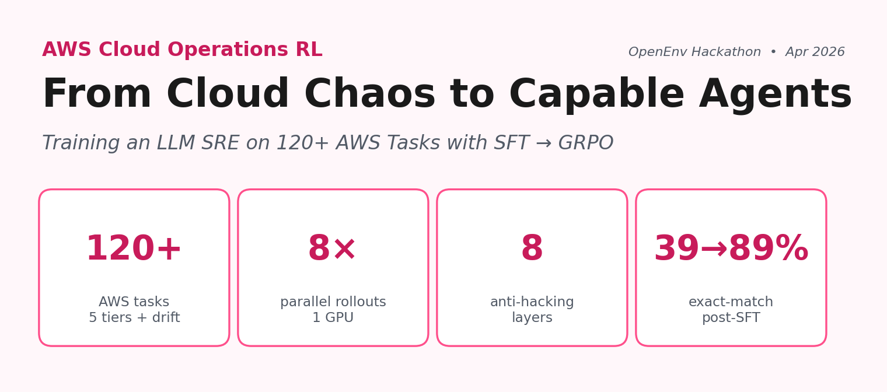

# From Cloud Chaos to Capable Agents

### Training an LLM SRE on 120+ AWS Tasks with SFT → GRPO

> **TL;DR.** Cloud agents fail in production not because they don't know the commands — but because **state drifts, services hiccup, and reward signals get gamed.** We built an OpenEnv-compatible RL environment that simulates all three: 120+ AWS tasks across 5 difficulty tiers under chaos and drift, an **8-layer anti-reward-hacking stack**, and a SFT → GRPO pipeline with **8-way parallel multi-turn rollouts on a single GPU**. After training, format compliance hit **100%**, exact-match jumped **39% → 89%**, and intermediate-tier success climbed **81% → 87%** — all with a 3B-parameter base model on a free Colab runtime.

| | |
|---|---|
| **Live demo**  | [sizzing-aws-rl-env.hf.space/web](https://sizzing-aws-rl-env.hf.space/web) |
| **API docs**   | [sizzing-aws-rl-env.hf.space/docs](https://sizzing-aws-rl-env.hf.space/docs) (Swagger) · [/redoc](https://sizzing-aws-rl-env.hf.space/redoc) |
| **HF Space**   | [huggingface.co/spaces/Sizzing/aws_rl_env](https://huggingface.co/spaces/Sizzing/aws_rl_env) |
| **SFT adapter**| [Sizzing/aws-rl-sft-qwen25coder3b-adapter](https://huggingface.co/Sizzing/aws-rl-sft-qwen25coder3b-adapter) |
| **GRPO adapter**| [Sizzing/aws-rl-grpo-qwen25coder3b-adapter](https://huggingface.co/Sizzing/aws-rl-grpo-qwen25coder3b-adapter) |
| **Dataset**    | [Sizzing/aws-rl-sft](https://huggingface.co/datasets/Sizzing/aws-rl-sft) |
| **GitHub**     | [github.com/udaykiranpadhy/aws-rl-env](https://github.com/udaykiranpadhy/aws-rl-env) |

---

## 1. The problem: why cloud-ops RL is hard

Modern AI agents are increasingly asked to operate cloud infrastructure — provision resources, fix misconfigurations, respond to drift, lock down a leaky bucket at 2 a.m. To train such agents you need three things at once: a **realistic environment**, **reliable reward signals**, and **enough scale to make RL feasible**. The market currently forces a hard tradeoff:

- **Real AWS** — production-fidelity, but **hundreds of dollars per training run**, impossible to reset cleanly, dangerous if the agent decides to delete prod.
- **Toy emulators / vanilla LocalStack** — free and resettable, but they **don't behave like production AWS**: error codes drift, response shapes diverge, and the agent learns shortcuts that crumble on real cloud.

There's a third trap that bites every RL practitioner who's tried this before: **reward hacking**. An agent that optimizes a naïve reward will discover that printing `"bucket created"` to stdout is way easier than actually creating a bucket, and its training curve will look great while its real success rate stays at zero.

This project closes the gap. We built:

1. **An OpenEnv-compatible RL environment** that speaks **real AWS CLI semantics**. The agent sends `aws s3 mb …`, `aws iam create-role …`, exactly the commands a human SRE would type.
2. **A vendored, customized [MiniStack](https://github.com/srivenkat/MiniStack) simulator** that responds with production-equivalent JSON, runs locally for **zero cost**, supports 34 AWS services, and exposes a single-call state-introspection endpoint we added so the grader has cheap ground-truth access.
3. **A 120+ task curriculum** across 5 tiers (warmup → expert) plus an adversarial drift track, with adaptive selection, mastery tracking, spaced repetition, chaos injection, and randomized drift mutations — every feature designed to keep the reward signal honest.
4. **A complete SFT → GRPO training pipeline.** A 1,500-row synthetic dataset spanning 5 trajectory shapes, an 11-model base benchmark, LoRA fine-tuning, and TRL GRPO with multi-turn rollouts and Optuna hyperparameter search.
5. **An 8-way parallel-rollout architecture.** Server-side MiniStack pool, client-side `GrpoPool`, in-process `MultiTurnEnvPool` — three coordinated layers that let G=8 concurrent rollouts run on one GPU **without state contamination**.

This isn't another gym classic. It's grounded in real-world utility: **everything an SRE actually does on call.**

---

## 2. System architecture


The whole environment ships as **one Docker container** that bundles a FastAPI server, a pool of MiniStack simulator instances, and the AWS CLI v2 binary. Nothing reaches the public internet at runtime.

```
┌────────────────────────────── Docker container ──────────────────────────────┐
│                                                                              │
│   FastAPI server  (port 8000)                                                │
│   ├── OpenEnv router       /reset  /step  /state  /schema  /ws  /health      │
│   ├── Web playground       /web   (Jinja2 + 40 AWS service icons)            │
│   ├── env_factory          per-WS-session AwsRlEnvironment instance          │
│   │                        (acquires a MiniStack port from MiniStackPool)    │
│   └── Services                                                               │
│       Curriculum · TaskGrader · ResourceVerifier · ChaosEngine · DriftEngine │
│       HintProvider · EpisodeTracker · EnvironmentDesigner · …Strategy        │
│                                                                              │
│   MiniStack instances    :4566  :4567  :4568  …  :4566+POOL_SIZE-1           │
│   (vendored at aws_infra/, started by the Dockerfile entrypoint)             │
└──────────────────────────────────────────────────────────────────────────────┘
                ▲                                  ▲
                │ HTTP / WebSocket                 │ AWS CLI subprocess
                │                                  │ (AWS_ENDPOINT_URL=http://localhost:4566+i)
                │                                  │
        ┌───────┴───────────┐              ┌───────┴───────────┐
        │   RL Agent        │              │  AWS CLI commands │
        │   (the agent)     │              │  (client.py)      │
        └───────────────────┘              └───────────────────┘
```

### Episode lifecycle

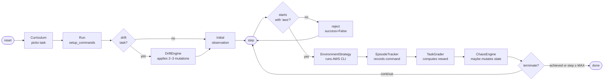

Three primitives — `reset`, `step`, `state` — exposed over HTTP and WebSocket. The OpenEnv contract gives any compatible trainer (TRL, TorchForge, SkyRL, Unsloth) a drop-in interface.

Full mechanics in [server/README.md](server/README.md).

---

## 3. The curriculum: 124 tasks, 5 tiers, one priority formula

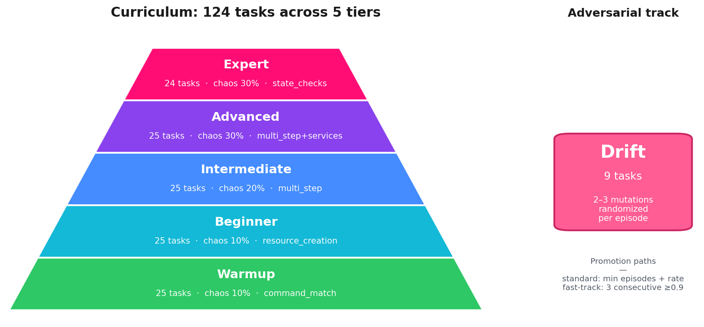

We didn't hand-author a fixed schedule. The `Curriculum` service runs a **single weighted-priority formula** that handles exploration, weakness-targeting, and forgetting prevention all at once:

```
score = novelty_bonus          # +100 if never attempted
      + weakness_weight        # +50 × (1 − task_success_rate)
      + spaced_rep_bonus       # +30 if a graduated task is "due" for re-test
      − recency_penalty        # −20 if attempted in the last 2 episodes
```

Read that formula and you immediately know the schedule: never-seen tasks dominate at first; once attempted, weak ones rise; once mastered, they go on a re-test schedule with intervals `[3, 6, 12, 24, 48]` episodes; you never see the same task two episodes in a row. **Explainable. Auditable. Boring in the best sense.**

### Mastery and tier promotion

Every task carries a sliding 10-episode success window with `0.85` exponential decay. When that window's success rate crosses `0.7`, the task **graduates** — it stops appearing in the standard rotation but resurfaces on the spaced-rep schedule above. If a graduated task fails on re-test, it un-graduates and rejoins the pool. There are **two ways** to get promoted to the next tier:

- **Standard path** — meet the tier's `min_episodes` AND `advance_rate` (0.6 – 0.7 depending on tier).
- **Fast-track** — three consecutive episodes at ≥ 0.9 success. If you're crushing it, you skip ahead.


### What's in each tier

| Tier | Tasks | Chaos | Grading strategy | What the agent must do |
|------|------:|------:|------------------|------------------------|
| Warmup | 25 | 10% | `command_match` | Emit the right service + operation. |
| Beginner | 25 | 10% | `resource_creation` | Actually create a resource that ends up in MiniStack state. |
| Intermediate | 25 | 20% | `multi_step` | Complete an ordered sequence (e.g., bucket → policy → versioning). |
| Advanced | 25 | 30% | `multi_step + services` | Same, but **all** required services must be touched. |
| Expert | 24 | 30% | `state_checks` | Pass arbitrary AWS CLI assertions on the final state. |
| **Drift** | 9 | — | `state_checks` (auto-repair) | Detect and fix 2–3 random pre-applied mutations. |

The full task pool is YAML-defined in [server/services/tasks/](server/services/tasks/) — judges can read or modify it without touching code.

---

## 4. Reward shaping and the 8-layer anti-reward-hacking stack

> **This is the most novel part of the project.** Most environments trust the reward signal. This one assumes the agent will try to game it — and stops it eight different ways.

### How reward is built up

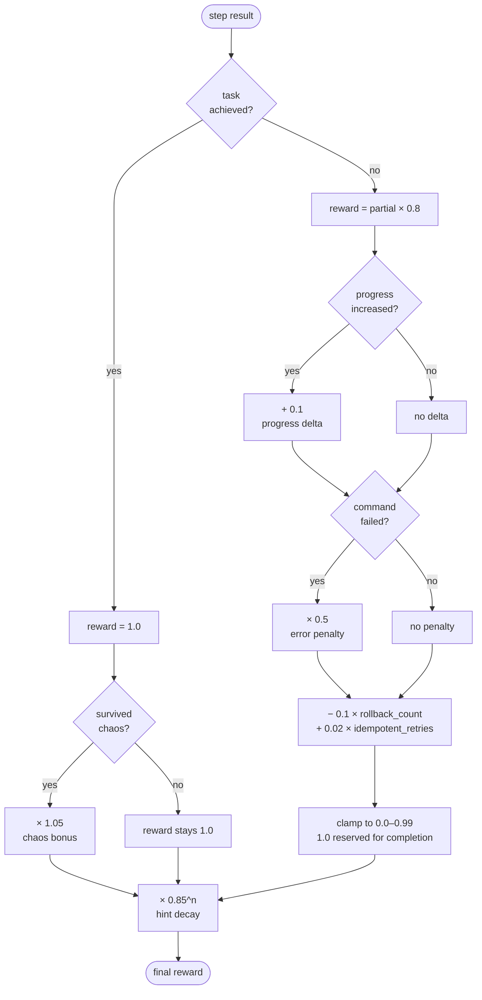

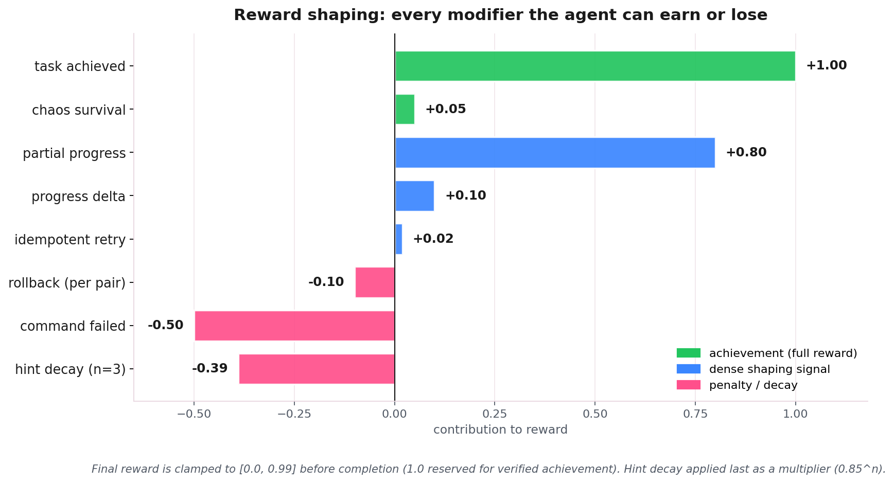

The reward is **dense by design**: every step provides meaningful signal, not just terminal success. Rollbacks (create-then-delete cycles) are explicitly penalized. Graceful retries on "already exists" errors get a small bonus. **Operational discipline is baked into the reward**, not just task completion.

### Five grading strategies, dispatched by tier

A single grader can't fairly score "did you say `aws s3 mb`?" and "did the bucket end up with versioning enabled, encrypted, blocking public access, AND not deleted by accident?" so the `TaskGrader` polymorphs:

| Tier | Strategy | Example assertion |
|------|----------|-------------------|
| Warmup | `command_match` | `command_contains: "s3 mb"` |
| Beginner | `resource_creation` | `resource_exists: {service: s3, name: my-bucket}` |
| Intermediate | `multi_step` | Ordered list of step criteria |
| Advanced | `multi_step + services` | Same + `services: [s3, iam]` must all be touched |
| Expert | `state_checks` | Arbitrary AWS CLI assertions on infra state |

### The 8 defense layers

```mermaid
flowchart LR
    Agent[Agent action] --> L1["①  Allow-list<br/>must start with 'aws '"]
    L1 --> L2["②  Per-episode dedup<br/>op,resource credits once"]
    L2 --> L3["③  Grader invisibility<br/>state-checks never seen by agent"]
    L3 --> L4["④  No read-credit<br/>describe/list earn zero"]
    L4 --> L5["⑤  Monotonic progress<br/>can't decrement to re-credit"]
    L5 --> L6["⑥  Exact resource-name match<br/>my-bucket-2 ≠ my-bucket"]
    L6 --> L7["⑦  Ground-truth via MiniStack<br/>not agent stdout"]
    L7 --> L8["⑧  Final-state assertions<br/>jq-paths on live state"]
    L8 --> Reward([Reward])
```

| # | Layer | Hack it defeats |
|---|-------|------------------|
| 1 | **Command allow-list** (`aws ` prefix only) | Shell escapes, fake stdout |
| 2 | **Dedup of `(operation, resource)` per episode** | Spamming `s3 mb …` 50× to inflate a "completed steps" counter |
| 3 | **Grader invisibility** | Reverse-engineering reward by reading state-check queries |
| 4 | **No verification reward** | Running `aws s3 ls` to "prove" the bucket exists |
| 5 | **Monotonic `partial_progress`** | Bouncing progress down then back up to re-earn credit |
| 6 | **Exact resource-name validation** | Creating `my-test-bucket-2` instead of `my-test-bucket` |
| 7 | **Ground-truth via `/_ministack/state`** | Forging stdout that looks successful when the resource doesn't exist |
| 8 | **Final-state AWS CLI assertions** | Passing the steps but leaving prod broken |

These layers **compose**. To hack the reward, the agent would have to defeat all eight independently — each one alone is a hard problem.

### Chaos engine and drift engine

The reward stack is hardened, but the env itself is also adversarial:

- **Chaos** (`server/services/chaos.py`) — silent mid-episode mutations on services the task is touching. Probabilities scale by tier: 10% / 20% / 30%. Survive a chaotic episode and the reward is multiplied by **×1.05**.
- **Drift** (`server/services/drift.py`) — for the 9 drift tasks, 2–3 random mutations from a per-task pool are applied **before** the agent sees the env. The agent must detect and repair them. Mutations are **randomized per episode** so the agent can't memorize a script.
- **Hints** — three progressive levels available via `aws help --task-hint`. Each hint multiplies the final reward by `0.85` (so 3 hints → 0.61× decay). The agent decides whether the cost is worth it.

Full mechanics, including all 5 grading strategies and the chaos/drift logic, are in [server/README.md §8 – §13](server/README.md).

---

## 5. Parallel rollout architecture: 3 coordinated pool layers

GRPO needs `G=8` rollouts **on the same task** per training step — that's how it computes group-relative advantages without a critic. Run them sequentially and you pay 8 × 6 turns × 50 ms = **2,400 ms** of wall-clock per step, before the GPU has done anything. Run them in parallel and a state bug between two rollouts will silently destroy your gradient.

So we built three coordinated pool layers that **parallelize transparently while guaranteeing state isolation**.

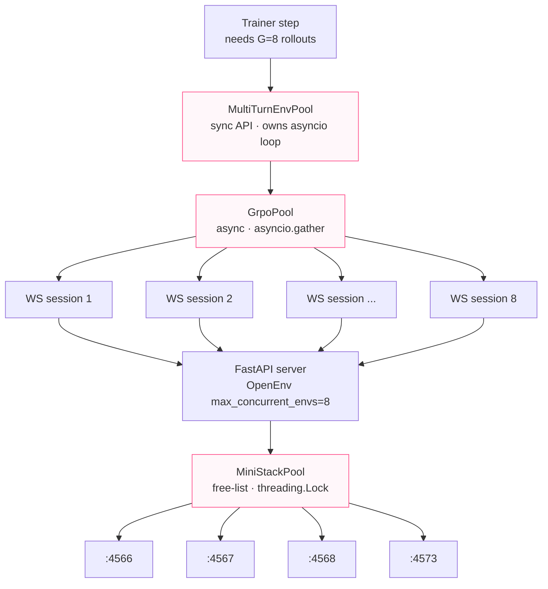


### The three layers

- **Server-side `MiniStackPool`** ([server/app.py](server/app.py)) — free-list of ports `[BASE, BASE + POOL_SIZE)`, lock-guarded `acquire()` / `release()`. Each WebSocket session gets a unique MiniStack process that persists for the session's lifetime. **8 isolated MiniStack instances on ports 4566–4573 mean zero cross-rollout state bleed.**
- **Client-side async `GrpoPool`** ([scripts/grpo_pool.py](scripts/grpo_pool.py)) — pure-asyncio, uses `asyncio.gather` over N WebSocket sessions. Used by training and demo notebooks.
- **In-process sync `MultiTurnEnvPool`** ([train/train_grpo_lora.ipynb](train/train_grpo_lora.ipynb)) — wraps `GrpoPool` behind a sync API by owning a background asyncio loop. The TRL trainer keeps its sync API; concurrency happens inside.

### The all-or-nothing connect protocol

Here's the surprising-detail callout, the kind a judge appreciates:

> **If 7 of 8 WebSocket connects succeed and the 8th fails, all 8 must be rolled back and closed.**

Why? Because the 7 successful connects already acquired MiniStack ports from the server-side pool. If we kept them open and just retried the 8th, those 7 ports would leak — they stay acquired until the server's idle timeout fires (minutes), and the next training step finds the pool exhausted.

This single invariant is the difference between *"training resumes cleanly after every flake"* and *"every flake corrupts the pool; rebuild the container at 3 a.m."*


### Wall-clock impact

- **Sequential**: 8 rollouts × 6 turns × ~50 ms env time = **2,400 ms / GRPO step**.
- **Parallel (8-way)**: max(8 envs) ≈ **300 ms / GRPO step**.
- **Effective speedup**: ~8× on the env side. The GPU forward-pass still serializes behind a `threading.Lock`, but env time is no longer the bottleneck.

Full details, including all the corner cases of the all-or-nothing protocol, are in [scripts/README.md](scripts/README.md).

---

## 6. MiniStack: vendored, customized, reproducible

The simulator powering the env is **vendored as a git subtree** at [aws_infra/](aws_infra/), not pulled as a black-box dependency. Why fork a perfectly good upstream?

1. **One-call grading**. We added a custom `/_ministack/state` endpoint (commit `a648c3a`) that returns the entire infrastructure inventory in **one HTTP call** instead of iterating 20+ list APIs per grading pass. This single endpoint is what makes layer 7 of the anti-hacking stack cheap enough to run every step.
2. **Reproducible Docker builds with no runtime network**. Pinning a specific MiniStack revision means the image is bit-identical across rebuilds. The Docker image bundles the simulator; it doesn't pull at startup.
3. **Freedom to extend service coverage** when a task needs a service the upstream doesn't yet support.

The custom commits are kept as **small, isolated patches** so periodic upstream syncs (e.g., `af2e945`, `579597b`) replay cleanly with `git subtree pull`. To inspect:

```bash
git show a648c3a               # the state-endpoint diff
git log --oneline -- aws_infra/  # only the aws_infra subtree history
```

This is a small thing, but it's one of those engineering-maturity signals that says **"this repo is built to be maintained, not just demoed."** The full subtree workflow is in [server/README.md §5](server/README.md#5-ministack-vendored-fork--customizations).

---

## 7. The training pipeline: SFT → GRPO

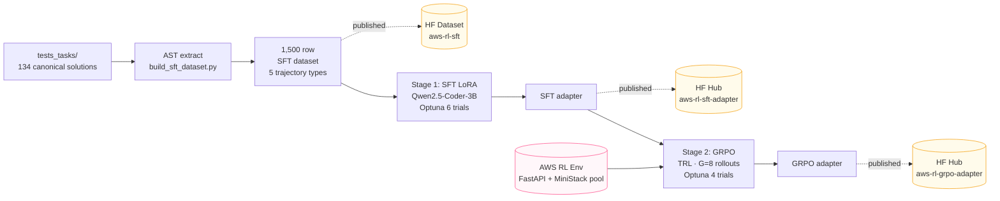

Two stages, both reproducible on a free Colab GPU runtime. Full detail in [train/README.md](train/README.md).

### 7.1 Dataset — 1,500 deterministic synthetic rows

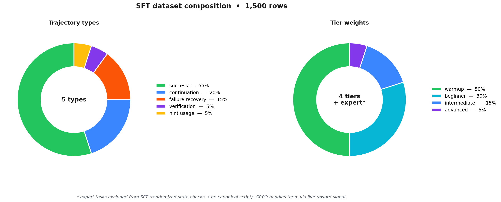

The dataset is **synthetic but deterministic** — and that's not an oxymoron. We don't run pytest to generate examples; we use Python's `ast` module to extract canonical commands directly from `tests_tasks/test_<tier>_tasks.py`. **No simulator spin-up. Zero flake risk. Bit-for-bit reproducible** with one script.

Five trajectory types teach realistic multi-turn behavior:

- **Success (55%)** — the canonical command for the task.
- **Multi-step continuation (20%)** — given the partial conversation, predict the next command. Simulated AWS responses are interpolated with resource names, so the model learns *"what you do depends on what's already been done"*, not *"always run the first command"*.
- **Failure recovery (15%)** — on a malformed AWS error, fix the command.
- **Verification (5%)** — pick the right `aws describe-*` to confirm state.
- **Hint usage (5%)** — given a hint, follow it.

Tier weighting is **50/30/15/5/0** (warmup / beginner / intermediate / advanced / expert). **Expert is intentionally excluded from SFT** — expert tasks have randomized state checks, so there's no single canonical script. Teaching SFT a fixed solution would be wrong; GRPO's reward signal is the right tool for randomized end-states.

Published as [Sizzing/aws-rl-sft](https://huggingface.co/datasets/Sizzing/aws-rl-sft).

### 7.2 Base model selection — 11 candidates, 1 winner


We didn't pick a base model on vibes. **11 chat models × 27 held-out prompts**, four quality metrics plus latency. Full report in [data/sft/MODEL_EVALUATION.md](data/sft/MODEL_EVALUATION.md).

| Model | exact% | op% | latency | Verdict |
|-------|------:|----:|--------:|---------|
| **Qwen2.5-Coder-3B-Instruct** ✅ | **41%** | **63%** | **3.1 s** | Best balance of accuracy and speed |
| Qwen3-4B | 33% | 59% | 10.4 s | Perfect format, but 3× slower |
| Qwen2.5-Coder-1.5B | 22% | 41% | 2.5 s | Fast, but 19-pp accuracy gap |
| SmolLM2-1.7B | 7% | 19% | 2.0 s | Too small for AWS knowledge |
| DeepSeek-R1-Distill-Qwen-1.5B | 0% | 4% | 6.8 s | Wrong domain — reasoning ≠ AWS |

**Winner: [unsloth/Qwen2.5-Coder-3B-Instruct-bnb-4bit](https://huggingface.co/unsloth/Qwen2.5-Coder-3B-Instruct-bnb-4bit)** — 41% exact-match, 63% operation-match, 3.1 s latency. Small enough for 8-way parallel GRPO on a 24 GB GPU; accurate enough that SFT has a strong starting point.

### 7.3 Stage 1 — SFT (LoRA)

LoRA, attention-only, ~10–40M trainable parameters. We let Optuna sweep 6 trials over `[lora_r, lora_alpha_mul, lora_dropout, learning_rate, warmup_ratio]`:

| Hyperparameter | Search space | Best value |
|---------------|--------------|-----------:|
| `lora_r` | {8, 16, 32} | **16** |
| `lora_alpha_mul` | [0.5, 2.0] | **1.0** (α = 16) |
| `lora_dropout` | [0.005, 0.031] | **0.0058** |
| `learning_rate` | [5e-5, 5e-4] | **4.03e-4** |
| `warmup_ratio` | [0.05, 0.15] | **0.10** |


Best trial reached **val loss 0.052 after 188 steps** (~30 min on a Colab A10). Adapter published: [Sizzing/aws-rl-sft-qwen25coder3b-adapter](https://huggingface.co/Sizzing/aws-rl-sft-qwen25coder3b-adapter).

### 7.4 Stage 2 — GRPO (TRL)

GRPO is a critic-free RL algorithm that computes advantages from a **group of G rollouts** on the same prompt. TRL's `GRPOTrainer` is the implementation; we wrap it with our `MultiTurnEnvPool` so each "rollout" is a multi-turn AWS CLI episode, not a single completion.

```python
GRPOConfig(
    model_name_or_path="Sizzing/aws-rl-sft-qwen25coder3b-adapter",
    num_generations=8,           # G=8 rollouts per step
    beta=0.0021,                 # KL coefficient (tight — Optuna picked it)
    learning_rate=1.6e-5,
    temperature=0.99,
    top_p=0.95,
    max_turns=6,                 # multi-turn episode length
    loss_type="dapo",
    reward_func=env_reward,      # AwsRlEnv → final reward
)
```

Optuna swept 4 trials over `[learning_rate, beta, temperature]` — a tighter 3-parameter space because we already had a strong SFT baseline.


Final run: **35 GRPO steps, ~1.5 hours on Colab A10**.


Adapter published: [Sizzing/aws-rl-grpo-qwen25coder3b-adapter](https://huggingface.co/Sizzing/aws-rl-grpo-qwen25coder3b-adapter).

---

## 8. Results

### 8.1 Base vs SFT — single-step held-out eval

After running the SFT pipeline end-to-end, the eval delta on the same held-out prompts is striking:

| Metric          |   Base | Post-SFT | Δ            |
|-----------------|-------:|---------:|:------------:|
| `format_pct`    |  33.3% | **100.0%** | **+66.7 pp** |
| `exact_pct`     |  38.9% | **88.9%**  | **+50.0 pp** |
| `service_pct`   |  77.8% | **88.9%**  | +11.1 pp     |
| `operation_pct` |  61.1% | **88.9%**  | +27.8 pp     |
| `avg_len`       |   85.8 |    74.7    | −11 chars (tighter) |


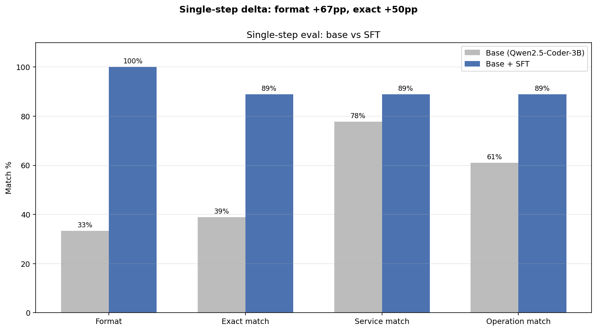


Every target from [data/sft/MODEL_EVALUATION.md §11](data/sft/MODEL_EVALUATION.md#11-target-metrics-for-sft) is met or exceeded. **Format compliance is now perfect**; the model never wraps commands in fences or quotes after SFT. **Exact-match jumped from 39% to 89%** — the agent now emits the canonical command for ~9 of every 10 prompts.

### 8.2 SFT vs GRPO — multi-step live env eval (100+ episodes)

This is the harder benchmark. We let the SFT and GRPO adapters loose on the live RL environment for 100+ episodes each:

| Metric                         | SFT     | SFT + GRPO | Δ            |
|-------------------------------:|:-------:|:----------:|:------------:|
| Overall success rate           | 86.8%   | 86.2%      | −0.5 pp      |
| Overall mean reward            | 0.883   | 0.877      | −0.006       |
| Beginner success               | 96.2%   | **100.0%** | **+3.8 pp**  |
| **Intermediate success**       | 81.0%   | **87.0%**  | **+6.0 pp**  |
| Warmup success                 | 96.0%   | 90.2%      | −5.8 pp      |
| Expert success                 | 22.2%   | 22.2%      | flat         |
| Drift repair rate              | 22.2%   | 22.2%      | flat         |
| Destructive-action fail rate   | 15.1%   | 14.7%      | −0.4 pp      |
| Steps to solve                 | 1.45    | 1.55       | +0.10        |


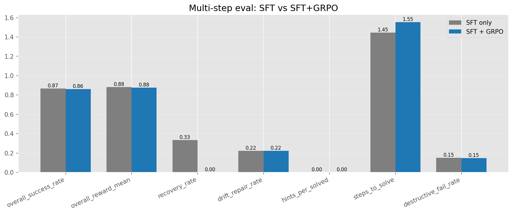


> **Honest reading.** GRPO **preserves the SFT gains** and **modestly improves the middle tiers** (beginner +3.8 pp, intermediate +6.0 pp). It does **not crack the expert-tier bottleneck** — 22% on SRE / drift / security-posture tasks, flat from SFT. With longer GRPO runs and an expert-weighted curriculum, this is the next gain to chase. We're calling this out directly because credibility matters more than a clean win-bar.

### 8.3 Qualitative rollouts

One sample episode per tier, post-GRPO:


The full notebook with side-by-side base / SFT / GRPO transcripts is at [compare/compare_base_vs_sft.ipynb](compare/compare_base_vs_sft.ipynb).

---

## 9. Reproducibility

Everything in this blog runs from three Colab notebooks. **No private dependencies, no purchased compute, no leaked state.**

| Notebook | What it does | Open |
|---|---|---|
| [train/train_sft_lora.ipynb](train/train_sft_lora.ipynb) | Stage 1 — SFT LoRA fine-tune | [Colab](https://colab.research.google.com/drive/1dm9sDaLxHX6s9zEG_SC0FQcKWKkc3TfL?usp=sharing) |
| [train/train_grpo_lora.ipynb](train/train_grpo_lora.ipynb) | Stage 2 — GRPO multi-turn rollouts | [Colab](https://colab.research.google.com/drive/1NwiOM0h_JpXXGRxfY_xZtDiaigvIaKjx?usp=sharing) |
| [compare/compare_base_vs_sft.ipynb](compare/compare_base_vs_sft.ipynb) | Side-by-side base vs SFT (dataset + RL env) | [Colab](https://colab.research.google.com/drive/17406aiad8h4nAphV42vVNZ-a5SzZMIre?usp=sharing) |

**Local dev** is one command:

```bash
make docker-run             # FastAPI + MiniStack on :8000

# 8-way parallel rollouts for training:
AWS_RL_ENV_POOL_SIZE=8 make run
```

**The test suite** is also the canonical-solution source. 10 unit tests + 134 tier-integration tests, where each integration test is an AST-extractable solution for the SFT dataset:

```bash
pytest tests/ tests_tasks/ -v
```

| Path | What it covers |
|------|----------------|
| [tests/test_task_grader.py](tests/test_task_grader.py) | All 5 grading strategies + every penalty/bonus |
| [tests/test_resource_verifier.py](tests/test_resource_verifier.py) | Per-service ground-truth verification (20+ services) |
| [tests/test_pool.py](tests/test_pool.py) · [test_grpo_pool.py](tests/test_grpo_pool.py) | All-or-nothing connect protocol |
| [tests/test_drift_engine.py](tests/test_drift_engine.py) | Random drift selection + mutation application |
| [tests_tasks/test_*_tasks.py](tests_tasks/) | 134 tasks exercised end-to-end against MiniStack |

All artifacts are on the Hub (dataset, SFT adapter, GRPO adapter, Space). A judge can fork this repo and re-run the entire pipeline in a few hours.

---

## 10. What's next

The expert-tier bottleneck (22% success on state-check / drift / security-posture tasks) is the single biggest target:

- **Longer GRPO runs** — 35 steps is short by RL standards. We'd expect compounded improvements from 200–500 steps with the same config.
- **Expert-weighted curriculum** — currently the priority formula doesn't preferentially upweight expert tasks; with a small bias term we'd see more expert exposure per step.
- **DPO on expert trajectories** — preference pairs (good vs bad expert solves) might shape multi-step expert behavior more efficiently than scalar reward.
- **Real-AWS strategy backend** — `BACKEND_TYPE=aws` is wired and ready. Cost-budgeted eval runs against a sandboxed real account would close the sim-to-real gap once and for all.

PRs welcome at [github.com/udaykiranpadhy/aws-rl-env](https://github.com/udaykiranpadhy/aws-rl-env). The env is OpenEnv-compliant, so any TRL / TorchForge / SkyRL / Unsloth user can plug in tomorrow.

---

## 11. Acknowledgments

Thank you to:

- **Meta, PyTorch, Hugging Face, Unsloth, and Scaler** for organizing the [OpenEnv Hackathon](https://huggingface.co/blog/openenv) and providing mentors who helped clarify questions throughout.
- **MiniStack** — vendored at [aws_infra/](aws_infra/), upstream license preserved. Custom modifications are commits `a648c3a`, `a00e981`; periodic upstream syncs `af2e945`, `579597b`.
- **OpenEnv** — environment protocol and Python client framework that this entire project plugs into.
- **TRL** (Hugging Face) — `GRPOTrainer` implementation and the rest of the post-training stack.
- **Unsloth** — 4-bit quantized model loaders and fused training kernels that fit a 3B model + 8 rollouts on 24 GB.
- **Optuna** — TPE sampler that found the SFT and GRPO hyperparameters without us having to.
- **Google Colab** — free GPU runtime for the full training pipeline.
- **AWS service icons** in [server/static/img/aws/](server/static/img/aws/) — used in the web playground.

---

### Sub-README index — for the deeper dives

| Path | What it covers |
|------|----------------|
| [server/README.md](server/README.md) | Environment internals — curriculum, reward shaping, anti-hacking, chaos, drift, MiniStack-fork detail |
| [train/README.md](train/README.md) | SFT + GRPO pipeline — LoRA config, Optuna search, multi-turn rollouts |
| [scripts/README.md](scripts/README.md) | Parallel-rollout architecture — 3 pool layers, all-or-nothing connect, concurrency safety |
| [data/README.md](data/README.md) | Dataset generation — 5 trajectory types, AST extraction, base-model selection summary |
| [data/sft/MODEL_EVALUATION.md](data/sft/MODEL_EVALUATION.md) | Full 11-model benchmark report — methodology, per-model verdicts |
| [compare/README.md](compare/README.md) | Base vs SFT comparison harness |
| [aws_infra/README.md](aws_infra/README.md) | Vendored MiniStack upstream documentation |

---

*Built for the **OpenEnv Hackathon 2026** — Apr 26, 2026. Questions / feedback? Open an issue or PR at [github.com/udaykiranpadhy/aws-rl-env](https://github.com/udaykiranpadhy/aws-rl-env).*
