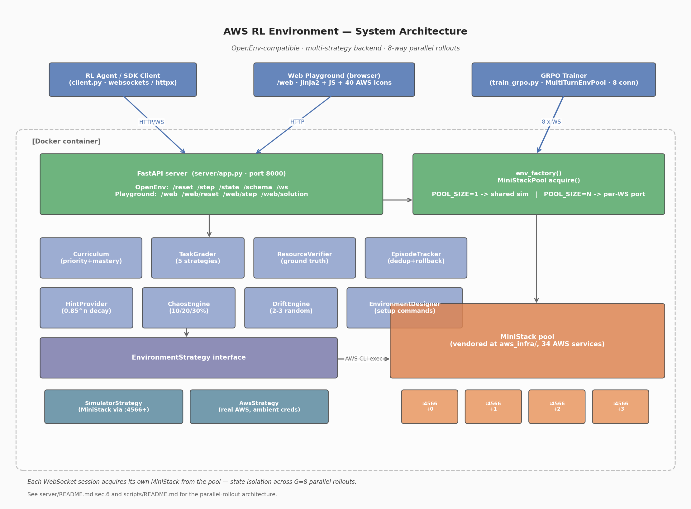
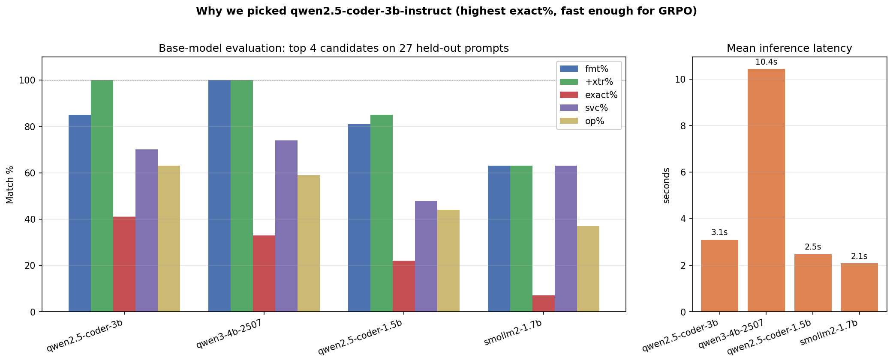
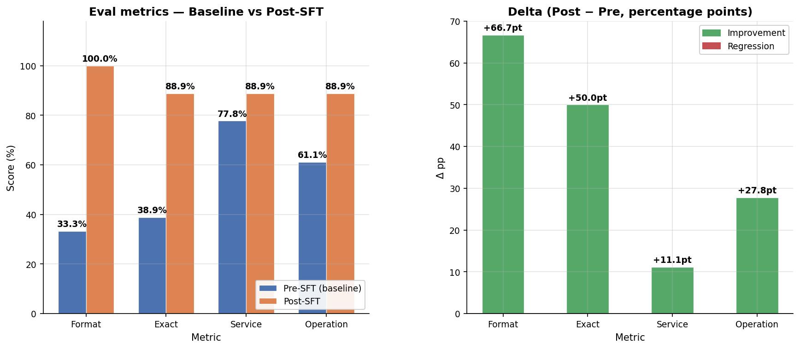
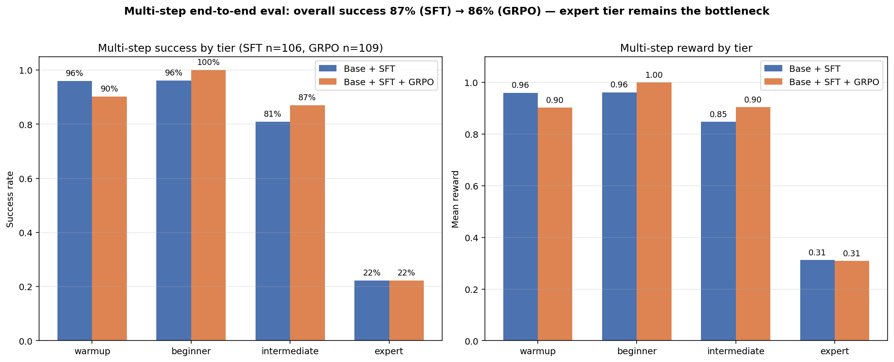
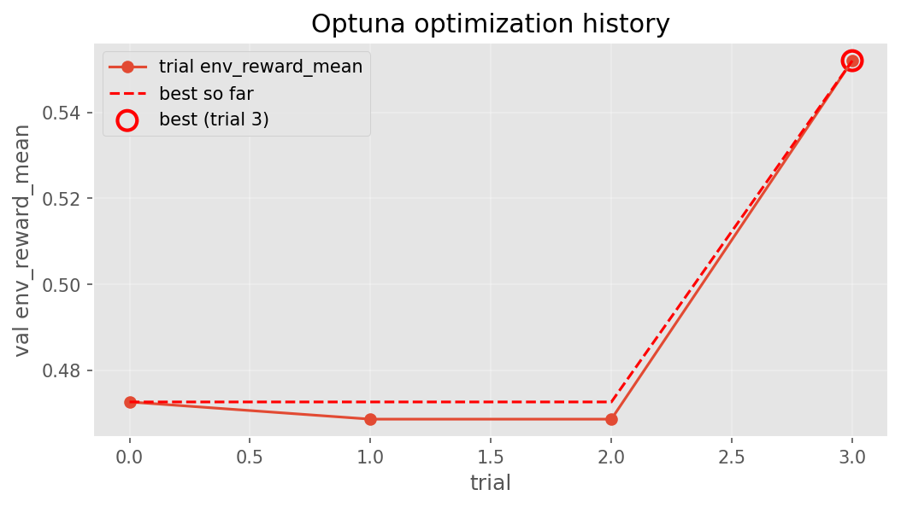
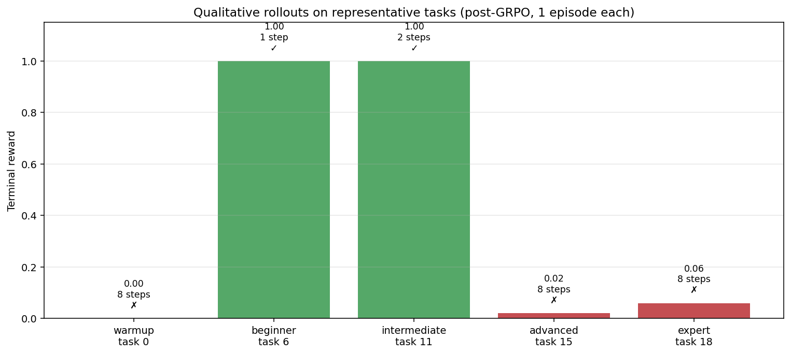

<p align="center">
  
</p>

# AWS Cloud Operations — RL Environment & Training Pipeline

> Cloud agents fail in production not because they don’t know the commands — but because state drifts, services hiccup, and reward signals get gamed. We built an environment that simulates all three: 120+ AWS tasks under chaos and drift, an 8-layer anti-reward-hacking stack, and an adversarial curriculum that targets the agent’s own weak spots. After SFT → GRPO on a single GPU with 8 parallel rollouts, format compliance hit 100%, exact-match jumped 39% → 89%, and intermediate-tier success climbed 81% → 87%.

| | |
|---|---|
| **Live demo** | [sizzing-aws-rl-env.hf.space/web](https://sizzing-aws-rl-env.hf.space/web) — try the playground in a browser |
| **API docs**  | [sizzing-aws-rl-env.hf.space/docs](https://sizzing-aws-rl-env.hf.space/docs) (Swagger), [/redoc](https://sizzing-aws-rl-env.hf.space/redoc) |
| **HF Space**  | [huggingface.co/spaces/Sizzing/aws_rl_env](https://huggingface.co/spaces/Sizzing/aws_rl_env) |
| **SFT adapter**| [Sizzing/aws-rl-sft-qwen25coder3b-adapter](https://huggingface.co/Sizzing/aws-rl-sft-qwen25coder3b-adapter) |
| **Dataset**   | [Sizzing/aws-rl-sft](https://huggingface.co/datasets/Sizzing/aws-rl-sft) |

---

## Table of contents

1. [What this is & why it matters](#1-what-this-is--why-it-matters)
2. [Highlights — full feature inventory](#2-highlights--full-feature-inventory)
3. [Architecture](#3-architecture)
4. [Live demo & Quick Start](#4-live-demo--quick-start)
5. [Run on Colab](#5-run-on-colab)
6. [Action / Observation spec](#6-action--observation-spec)
7. [Curriculum & Reward (overview)](#7-curriculum--reward-overview)
8. [Training pipeline (SFT → GRPO)](#8-training-pipeline-sft--grpo)
9. [Parallel rollout architecture](#9-parallel-rollout-architecture)
10. [MiniStack: vendored & customized](#10-ministack-vendored--customized)
11. [Results & Benchmarks](#11-results--benchmarks)
12. [Repository map](#12-repository-map)
13. [Configuration & Running](#13-configuration--running)
14. [Testing](#14-testing)
15. [Tech stack](#15-tech-stack)
16. [Links](#16-links)
17. [Acknowledgments](#17-acknowledgments)

---

## 1. What this is & why it matters

Modern AI agents are increasingly asked to operate cloud infrastructure — provisioning resources, fixing misconfigurations, responding to drift. Training such agents needs (a) a realistic environment, (b) reliable reward signals, and (c) enough scale to make RL feasible. Existing options force a hard tradeoff: real AWS costs hundreds of dollars per training run and is impossible to reset; toy emulators don't behave like production AWS.

**This project closes that gap.** We built:

1. **An OpenEnv-compatible RL environment** that speaks real AWS CLI semantics. The agent sends `aws s3 mb …`, `aws iam create-role …`, and so on — the exact same commands a human SRE would type.
2. **A vendored, customized MiniStack simulator** that responds with production-equivalent JSON, runs locally for zero cost, supports 34 AWS services, and exposes a single-call state-introspection endpoint we added so the grader has cheap ground-truth access.
3. **A 120+ task curriculum** across 5 tiers (warmup → expert) with adaptive selection, mastery tracking, spaced repetition, chaos injection, and drift-detection scenarios — every feature designed to keep the reward signal honest and prevent the agent from gaming it.
4. **A complete SFT → GRPO training pipeline.** A 1,500-row synthetic dataset spanning 5 trajectory shapes, an 11-model base benchmark, LoRA fine-tuning, and TRL GRPO with multi-turn rollouts and Optuna hyperparameter search.
5. **An 8-way parallel-rollout architecture.** Server-side MiniStack pool, client-side `GrpoPool`, in-process `MultiTurnEnvPool` — three coordinated layers that let G=8 concurrent rollouts run on one GPU without state contamination.

Everything is reproducible: the dataset is generated by a deterministic script, the model selection is documented end-to-end, training entry points run on Colab, and the env runs locally in a single Docker container with no external network requirement.

---

## 2. Highlights — full feature inventory

This is the complete surface area of the project. Each entry links to deeper documentation in the corresponding sub-README.

### Environment & Curriculum
- **[120+ tasks across 5 tiers](server/services/tasks/)** — warmup (25), beginner (25), intermediate (25), advanced (25), expert (24), drift (9). YAML-defined task spec per tier.
- **[Curriculum learning with priority scoring](server/README.md#7-curriculum-manager)** — `score = novelty + weakness − recency + spaced_rep_bonus` drives task selection.
- **[Mastery tracking](server/README.md#7-curriculum-manager)** — sliding 10-episode window, 0.7 threshold, 0.85 exponential decay, supports un-graduation.
- **[Spaced repetition](server/README.md#7-curriculum-manager)** — graduated tasks resurface at intervals `[3, 6, 12, 24, 48]` to prevent forgetting.
- **[Tier promotion](server/README.md#7-curriculum-manager)** — standard (min episodes + success rate) + fast-track (3 consecutive ≥90% episodes).
- **[Strategy pattern: simulator vs real AWS](server/README.md#4-strategy-pattern-simulator-vs-real-aws)** — `BACKEND_TYPE=simulator` (default) or `aws`, no code fork.

### Reward shaping
- **[Five grading strategies](server/README.md#8-reward-shaping--taskgrader)** — command-match (warmup), resource-creation (beginner), multi-step (intermediate), multi-step+services (advanced), state-checks (expert).
- **[Dense partial-progress signal](server/README.md#8-reward-shaping--taskgrader)** — clamped to `[0.0, 0.99]`, `1.0` reserved for verified completion.
- **[Rollback penalty](server/README.md#8-reward-shaping--taskgrader)** — `−0.1` per `(create-X, …, delete-X)` pair.
- **[Idempotency bonus](server/README.md#8-reward-shaping--taskgrader)** — `+0.02` for graceful "already exists" retry.
- **[Hint decay](server/README.md#13-hint-provider)** — three-level progressive hints with `0.85^n` reward multiplier.
- **[Chaos survival bonus](server/README.md#11-chaos-engine)** — `×1.05` if the agent completes a chaotic task.

### Resilience & adversarial features
- **[Chaos injection](server/README.md#11-chaos-engine)** — silent mid-episode mutations, tier-scaled probabilities (10/20/30%) on services the task is touching.
- **[Drift detection](server/README.md#12-drift-engine)** — 6 expert tasks, 2–3 random mutations from a per-task pool, randomized per episode (no memorization).
- **[Security-posture audit tasks](server/README.md#17-security-posture-audit-examples)** — S3 public bucket lockdown, IAM least-privilege, Lambda secret rotation.
- **[8-layer anti-reward-hacking](server/README.md#9-anti-reward-hacking--8-defense-layers)** — ground-truth verification, dedup, grader invisibility, command allow-list, no-credit-for-reads, monotonic progress, exact resource-name validation, final state checks.

### Training pipeline
- **[Synthetic SFT dataset (1,500 rows)](data/README.md)** — 5 trajectory types: success / multi-step continuation / failure recovery / verification / hint usage.
- **[Rigorous base-model selection](data/sft/MODEL_EVALUATION.md)** — 11 models × 27 prompts, [Qwen2.5-Coder-3B-Instruct](https://huggingface.co/unsloth/Qwen2.5-Coder-3B-Instruct-bnb-4bit) wins.
- **[LoRA SFT](train/README.md#1-sft-stage--supervised-lora)** — `r ∈ {8,16,32}`, `lora_alpha = r × multiplier`, attention-only adaptation.
- **[GRPO RL via TRL](train/README.md#2-grpo-stage--reinforcement-learning)** — group-relative advantages, KL to SFT reference, `dapo` loss, no critic.
- **[Multi-turn rollouts](train/README.md#4-multi-turn-rollouts--parallel-envs)** — up to `MAX_TURNS=6`, observation fed back as next-turn user message.
- **[Optuna hyperparameter search](train/README.md#3-optuna-hyperparameter-search)** — TPE sampler over 8-dim space, frozen held-out validation set.
- **[HuggingFace integration](data/README.md#7-huggingface-publishing)** — adapter + dataset published to Hub, OpenEnv Space deployment.

### Parallel rollout architecture
- **[Server-side MiniStack pool](server/README.md#6-server-side-ministack-pool-parallel-rollouts)** — `MiniStackPool` ([server/app.py](server/app.py)), free-list of ports, lock-guarded acquire/release.
- **[Client-side GrpoPool](scripts/README.md#2-three-coordinated-pool-layers)** — async-native, all-or-nothing connect, asyncio.gather for concurrent rollouts.
- **[In-process MultiTurnEnvPool](train/README.md#4-multi-turn-rollouts--parallel-envs)** — sync API, owns a background asyncio loop, used by the trainer.
- **[8 isolated rollouts on one server](scripts/README.md#7-running-the-multi-connection-demo)** — proof in [scripts/TestMultipleConnects.ipynb](scripts/TestMultipleConnects.ipynb).

### Vendored simulator
- **[MiniStack as git subtree](server/README.md#5-ministack-vendored-fork--customizations)** — vendored at [aws_infra/](aws_infra/) (commit `2c38c0b`). 34 AWS services. MIT.
- **[Custom `/_ministack/state` endpoint](server/README.md#5-ministack-vendored-fork--customizations)** — added in commit `a648c3a`; returns full infra inventory in one call.
- **[Upstream sync workflow](server/README.md#5-ministack-vendored-fork--customizations)** — periodic `git subtree pull`; isolated patches keep conflicts minimal.

### Operations & deployment
- **[OpenEnv-compliant](https://github.com/openai/openenv)** — `/reset`, `/step`, `/state`, `/schema`, `/ws` HTTP+WebSocket endpoints.
- **[Web playground UI](server/README.md#19-web-playground)** — `/web` route, 40 AWS service icons, Jinja2 + JS frontend.
- **[Docker-first deployment](Dockerfile)** — multi-stage build, container ships server + N MiniStack instances + AWS CLI.
- **[Comprehensive test suite](#14-testing)** — 10 unit tests + 6 tier-integration suites covering 134 tasks.

---

## 3. Architecture

> 

```
┌────────────────────────────────── Docker container ──────────────────────────────────┐
│                                                                                      │
│   FastAPI server  (port 8000)                                                        │
│   ├── OpenEnv router       /reset  /step  /state  /schema  /ws  /health              │
│   ├── Web playground       /web  (Jinja2 + 40 AWS icon SVGs)                         │
│   ├── env_factory          per-WS-session AwsRlEnvironment instance                  │
│   │                        (acquires a MiniStack port from MiniStackPool)            │
│   └── Services                                                                       │
│       Curriculum · TaskGrader · ResourceVerifier · ChaosEngine · DriftEngine         │
│       HintProvider · EpisodeTracker · EnvironmentDesigner · EnvironmentStrategy      │
│                                                                                      │
│                                                                                      │
│   MiniStack instances    :4566  :4567  :4568  …  :4566+POOL_SIZE-1                   │
│   (vendored at aws_infra/, started by the Dockerfile entrypoint)                     │
│                                                                                      │
└──────────────────────────────────────────────────────────────────────────────────────┘
                ▲                                  ▲
                │ HTTP/WS                          │ AWS CLI subprocess
                │                                  │ (AWS_ENDPOINT_URL=http://localhost:4566+i)
                │                                  │
        ┌───────┴───────────┐              ┌───────┴───────────┐
        │   RL Agent        │              │  AWS CLI commands │
        │   the agent emits │              │  (client.py)      │
        └───────────────────┘              └───────────────────┘
```

### Episode lifecycle

1. **`reset()`** — wipes simulator state, picks next task from the curriculum, runs `setup_commands`, applies drift if applicable, returns initial observation.
2. **`step(action)`** — validates the command (must start with `aws `), intercepts hint requests, executes via the strategy, records in tracker, grades with shaped reward, optionally injects chaos, returns observation.
3. **Hint** — agent sends `aws help --task-hint`; intercepted before reaching MiniStack; returns next-level hint, increments `hints_used` (which decays final reward by `0.85^n`).
4. **Termination** — `task_achieved=True` or `step_count >= MAX_STEPS` (default 15).

Full mechanics in [At server/README.md file](server/README.md).

---

## 4. Live demo & Quick Start

### Try it in a browser

The hosted playground lets you click around any task without writing code:

> **[Hugging Face Spaces Playground](https://sizzing-aws-rl-env.hf.space/web#playground)**

### Python client

```python
from aws_rl_env import AwsRlAction, AwsRlEnv

with AwsRlEnv.from_docker_image("aws-rl-env:latest") as env:
    result = env.reset()
    print(f"Task: {result.observation.task.description}")

    result = env.step(AwsRlAction(command="aws s3 mb s3://my-bucket"))
    print(f"Reward: {result.reward}, Done: {result.done}")
```

Or against a running server:

```python
env = AwsRlEnv(base_url="http://localhost:8000")
result = env.reset()
result = env.step(AwsRlAction(command="aws s3 ls"))
```

### WebSocket API

```python
import websockets, json

async with websockets.connect("wss://sizzing-aws-rl-env.hf.space/ws") as ws:
    await ws.send(json.dumps({"type": "reset"}))
    obs = json.loads(await ws.recv())

    await ws.send(json.dumps({"type": "step", "data": {"command": "aws s3 ls"}}))
    obs = json.loads(await ws.recv())
```

### Local Docker

```bash
make docker-build           # build the image
make docker-run             # foreground; serves on :8000
make docker-run-detach      # background
make docker-health          # liveness probe
```

For training (8-way parallel rollouts):

```bash
AWS_RL_ENV_POOL_SIZE=8 make run
```

---

## 5. Run on Colab

The full pipeline is reproducible on a Colab GPU runtime. Drop your token into Colab Secrets, set `ENV_BASE_URL` to your HF Space (or local with ngrok), and run.

| Notebook                                                                            | What it does                                          | Open in Colab                                |
|-------------------------------------------------------------------------------------|-------------------------------------------------------|----------------------------------------------|
| [train/train_sft_lora.ipynb](train/train_sft_lora.ipynb)                            | Stage 1 — SFT LoRA fine-tuning of Qwen2.5-Coder-3B    | <!-- TODO: paste Colab URL here --> |
| [train/train_grpo_lora.ipynb](train/train_grpo_lora.ipynb)                          | Stage 2 — GRPO RL training with multi-turn rollouts   | <!-- TODO: paste Colab URL here --> |
| [compare/compare_base_vs_sft.ipynb](compare/compare_base_vs_sft.ipynb)              | Side-by-side: base model vs SFT adapter (dataset + RL env) | <!-- TODO: paste Colab URL here --> |

Replace each `<!-- TODO -->` with the Colab badge URL once published.

---

## 6. Action / Observation spec

The full Pydantic data models — kept inline so any reader can wire up an agent without leaving this page. Source: [models.py](models.py).

### Action

```python
class AwsRlAction(Action):
    command: str   # AWS CLI command, e.g. "aws s3 ls"
```

The environment validates that `command` starts with `aws `; anything else is rejected with `success=False`.

### Observation

```python
class AwsRlObservation(Observation):
    episode_id: EpisodeID
    step_count: StepCount
    command_success: bool          # exit code == 0
    command_output: str            # stdout from the AWS CLI invocation
    error: str                     # stderr (empty if success)
    task: TaskInfo | None          # masked task definition (no success criteria)
    task_achieved: bool
    partial_progress: float        # current task progress in [0.0, 1.0]
    hints_used: int                # cumulative hint count this episode
    hint_text: str                 # most recent hint text (if any)
```

### State

```python
class AwsRlState(State):
    current_task: Task | None      # full task assigned for the episode
    tracker: TrackerState          # episode tracker snapshot
    infra_state: dict              # AWS infrastructure state keyed by service name
    chaos_occurred: bool           # whether chaos was injected this episode
    current_tier: str              # agent's current difficulty tier

class TrackerState:
    step_count: int                # steps taken this episode
    hints_used: int                # hints requested this episode
    progress: float                # current partial progress [0.0, 1.0]
    commands_executed: list[str]   # commands executed this episode
    credited_operations: list[str] # (operation, resource) pairs that earned credit
```

### Task definitions

```python
class Task:
    task_id: TaskID
    difficulty: TaskDifficulty       # warmup | beginner | intermediate | advanced | expert
    description: str                 # human-readable goal
    success_criteria: SuccessCriteria
    setup_commands: list[SetupCommand]      # pre-provision for SRE tasks
    desired_state_spec: str | None          # natural-language desired end state (drift tasks)
    possible_drifts: list[SetupCommand]     # pool of mutations for DriftEngine

class TaskInfo:
    """Agent-visible subset of Task — masks success_criteria, setup_commands, and possible_drifts."""
    task_id: TaskID
    difficulty: TaskDifficulty
    description: str
    desired_state_spec: str | None

class SuccessCriteria:
    command_contains: str | None                   # warmup/beginner
    operation: str | None                          # warmup/beginner
    resource_exists: ResourceExistsCheck | None    # beginner
    steps: list[StepCriteria]                      # intermediate/advanced/expert
    services: list[AwsService]                     # advanced/expert
    state_checks: list[StateCheck]                 # expert (ground truth)
```

### Curriculum config

```python
class TierConfig:
    min_episodes: int          # minimum episodes before promotion
    advance_rate: float        # tier success rate threshold (0.6 - 1.0)
    mastery_window: int        # sliding window size (default: 10)
    mastery_threshold: float   # per-task graduation threshold (default: 0.7)
    fast_track_rate: float    # early promotion threshold (default: 0.9)
    chaos_probability: float   # probability of chaos injection per step

class SpacedRepState:
    interval: int                  # episodes until next re-test (3 → 48)
    last_graduated_episode: int    # when last graduated
```

---

## 7. Curriculum & Reward (overview)

The curriculum and reward stack is the heart of the project. This section is the elevator pitch; **the full mechanics — priority scoring math, anti-reward-hacking layers, chaos engine, drift engine — live in [server/README.md](server/README.md)**.

### Priority scoring (one-formula task selection)

```
score = novelty_bonus          # +100 if never attempted
      + weakness_weight        # +50 × (1 − task_success_rate)
      + spaced_rep_bonus       # +30 if a graduated task is "due" for re-test
      − recency_penalty        # −20 if attempted in the last 2 episodes
```

Exploration, weakness-targeting, anti-forgetting, and variety — all balanced by one weighted sum.

### Reward shaping

```
if task_achieved:
    reward = 1.0
    if survived_chaos:    reward *= 1.05      # chaos survival bonus
else:
    reward = partial_progress * 0.8           # ≤ 0.8 from steps alone
    if progress_increased: reward += 0.1      # dense progress signal
    if command_failed:     reward *= 0.5      # error penalty
    reward -= 0.1 * rollback_count            # waste penalty
    reward += 0.02 * idempotent_retries       # graceful retry bonus
    reward = clamp(reward, 0.0, 0.99)         # 1.0 reserved for completion

reward *= 0.85 ** hints_used                  # hint decay applied last
```

The agent's loss surface is intentionally narrow: only doing the task earns full reward, and every reward-hacking shortcut we identified during design has a defense layer (full list in [server/README.md §9](server/README.md#9-anti-reward-hacking--8-defense-layers)).

> 

---

## 8. Training pipeline (SFT → GRPO)

The training pipeline runs in two stages, both reproducible on Colab. Full detail in **[train/README.md](train/README.md)**.

```
                      ┌────────── data/sft/ ──────────┐
                      │  1,500 train · 150 val rows   │
                      │  5 trajectory types           │
                      └───────────────┬───────────────┘
                                      ▼
   STAGE 1 — Supervised Fine-Tuning   train/train_sft_lora.ipynb
   Qwen2.5-Coder-3B-Instruct + LoRA r=8/16/32 (Optuna) → SFT adapter
                                      │
                                      │ Sizzing/aws-rl-sft-qwen25coder3b-adapter
                                      ▼
   STAGE 2 — GRPO RL                  train/train_grpo_lora.ipynb
   G=8 parallel rollouts · multi-turn · reward = env return
   Optuna over (lr, β, G, T, top_p, lora_r, max_turns)
```

### Numbers worth knowing

| | |
|---|---|
| **Base model** | `unsloth/Qwen2.5-Coder-3B-Instruct-bnb-4bit` — picked via [data/sft/MODEL_EVALUATION.md](data/sft/MODEL_EVALUATION.md) |
| **SFT LoRA** | `r ∈ {8,16,32}`, `lora_alpha = r × multiplier`, target = attention only, dropout `[0.005, 0.031]` |
| **GRPO config** | `G=8`, `β=0.04`, `lr=5e-6`, `T=0.9`, `top_p=0.95`, `max_turns=6`, loss=`dapo` |
| **Optuna search** | TPE sampler, 6 trials × 30 GRPO steps, frozen 10-task held-out val set |
| **Final training** | 200 GRPO steps with best config |

### Training graphs

> Embed once notebook is executed:
> 
> 
> 
> 

---

## 9. Parallel rollout architecture

GRPO needs `G` rollouts on the same task per training step. We run all G in parallel with **state isolation guaranteed**. Three coordinated pool layers make it work:

```
                        Trainer (G=8 generations needed per step)
                                        │
                   ┌────────────────────┼────────────────────┐
                   ▼                    ▼                    ▼
            MultiTurnEnvPool        GrpoPool            (in-process)
            (train_grpo.py)         (scripts/grpo_pool.py)
            sync API                async API
                   │                    │
                   └─────── 8 WebSocket connections ────────┘
                                        │
                                        ▼
                            FastAPI server  :8000
                            + OpenEnv max_concurrent_envs=8
                                        │
                                        ▼
                            MiniStackPool (free-list, lock-guarded)
                            acquire(port) on connect, release on disconnect
                                        │
                                        ▼
                    8 isolated MiniStack instances :4566..:4573
```

Wall-clock impact: an 8-rollout × 6-turn episode runs in ~300 ms of env time vs ~2.4 s sequential. Full mechanics, including the **all-or-nothing connect protocol** that prevents pool-slot leakage on flake, are in **[scripts/README.md](scripts/README.md)**.

> 

---

## 10. MiniStack: vendored & customized

The simulator powering the env is **vendored** as a git subtree at [aws_infra/](aws_infra/), not pulled as a black-box dependency. We forked it because we needed:

1. A custom `/_ministack/state` JSON endpoint so the grader can read the entire infra inventory in **one HTTP call** instead of iterating 20+ list APIs per grading pass. Added in commit `a648c3a "feat: Add support for service state retrieval and action listing across multiple AWS services"`.
2. A reproducible build with no runtime network requirement — the Docker image bundles a specific MiniStack revision.
3. The freedom to extend service coverage on demand.

Custom commits live as small, isolated patches so periodic upstream syncs (`af2e945`, `579597b`) replay cleanly. To inspect:

```bash
git show a648c3a               # the state-endpoint diff
git log --oneline -- aws_infra/  # only the aws_infra subtree history
```

Full subtree workflow + commit-by-commit detail in [server/README.md §5](server/README.md#5-ministack-vendored-fork--customizations). Upstream MiniStack docs (81 KB) are preserved at [aws_infra/README.md](aws_infra/README.md).

---

## 11. Results & Benchmarks

### Base-model selection

We evaluated 11 chat models on 27 held-out prompts. **Qwen2.5-Coder-3B-Instruct** wins on every metric that matters: 41% exact match (highest), 63% operation match (highest), 3.1 s/call (3× faster than the 4B runner-up). Full report:

> **[data/sft/MODEL_EVALUATION.md](data/sft/MODEL_EVALUATION.md)** — 270-line writeup, per-model verdicts, methodology

> 

### Base vs SFT — actual results

After running the SFT pipeline end-to-end, the eval delta on the same held-out prompts is striking:

| Metric          | Base   | Post-SFT | Delta       |
|-----------------|:------:|:--------:|:-----------:|
| `format_pct`    | 33.3%  | **100.0%** | **+66.7 pp** |
| `exact_pct`     | 38.9%  | **88.9%**  | **+50.0 pp** |
| `service_pct`   | 77.8%  | **88.9%**  | +11.1 pp    |
| `operation_pct` | 61.1%  | **88.9%**  | +27.8 pp    |
| `avg_latency`   | 2.03s  | **1.40s**  | −0.63s (faster!) |
| `avg_len`       | 85.8   | 74.7     | −11 chars (tighter) |

> 

Every target from [data/sft/MODEL_EVALUATION.md §11](data/sft/MODEL_EVALUATION.md) is met or exceeded. Format compliance is now perfect; the model never wraps commands in fences or quotes after SFT. Exact-match jumped from 39% to 89% — the agent now emits the canonical command for ~9 of every 10 prompts.

The richer two-mode benchmark (dataset eval + live RL env eval) is in [compare/compare_base_vs_sft.ipynb](compare/compare_base_vs_sft.ipynb); methodology in [compare/README.md](compare/README.md).

> 
> 

### SFT training curves

> 

### Optuna SFT search

The best SFT trial (out of 6) used `lora_r=16, lora_alpha=16, dropout=0.0058, lr=4.03e-4, warmup=0.1` — see [train/README.md §3](train/README.md#3-optuna-hyperparameter-search) for the full Optuna study table.

> 
> 

### GRPO results (live multi-step env eval)

After 35 GRPO steps on top of the SFT adapter (best Optuna config: `lr=1.6e-5, β=0.0021, T=0.99`), we re-evaluated end-to-end on 100+ episodes:

| Metric                        | Base + SFT | Base + SFT + GRPO | Δ            |
|-------------------------------|:---------:|:-----------------:|:------------:|
| Overall success rate          | 86.8%     | 86.2%             | −0.5 pp      |
| Overall mean reward           | 0.883     | 0.877             | −0.006       |
| Beginner success              | 96.2%     | **100.0%**        | **+3.8 pp**  |
| Intermediate success          | 81.0%     | **87.0%**         | **+6.0 pp**  |
| Warmup success                | 96.0%     | 90.2%             | −5.8 pp      |
| Expert success                | 22.2%     | 22.2%             | flat         |
| Drift repair rate             | 22.2%     | 22.2%             | flat         |
| Destructive-action fail rate  | 15.1%     | 14.7%             | −0.4 pp      |
| Steps to solve                | 1.45      | 1.55              | +0.10        |

> 
> 

**Honest reading:** the 35-step GRPO run preserves the SFT gains and modestly improves the middle tiers (beginner +3.8 pp, intermediate +6.0 pp) — but does not crack the **expert-tier bottleneck** (22% success on SRE / drift / security-posture tasks). With longer GRPO runs and more curriculum exposure to expert tasks, this is the next gain to chase.

### GRPO training curves

Per-step training signals from the final 35-step GRPO run:

> 
> 

Optuna search across 4 trials picked the final config:

> 
> 
> 

### Qualitative rollouts (post-GRPO)

One sample episode per tier:

> 

---

## 12. Repository map

| Path                           | Purpose                                                            | Sub-README                              |
|--------------------------------|--------------------------------------------------------------------|-----------------------------------------|
| [server/](server/)             | OpenEnv FastAPI server, env logic, services, web playground       | [server/README.md](server/README.md)    |
| [train/](train/)               | SFT and GRPO training notebooks                                   | [train/README.md](train/README.md)      |
| [data/](data/)                 | SFT dataset, base-model selection, eval harness                   | [data/README.md](data/README.md) · [MODEL_EVALUATION.md](data/sft/MODEL_EVALUATION.md) |
| [compare/](compare/)           | Base vs SFT side-by-side benchmark                                | [compare/README.md](compare/README.md)  |
| [scripts/](scripts/)           | Parallel-rollout architecture + multi-connection demo             | [scripts/README.md](scripts/README.md)  |
| [aws_infra/](aws_infra/)       | Vendored MiniStack simulator (git subtree)                        | [aws_infra/README.md](aws_infra/README.md) |
| [tests/](tests/), [tests_tasks/](tests_tasks/) | Unit + tier-integration test suites                       | (see [§14](#14-testing))                |
| [models.py](models.py)         | Pydantic data models for action/observation/task                  | (inline §6)                             |
| [client.py](client.py)         | OpenEnv HTTP/WebSocket client wrapper                             | —                                       |
| [inference.py](inference.py)   | Single-model agent loop (matches RL eval mode of `compare/`)      | —                                       |
| [train_grpo.py](train_grpo.py) | GRPO trainer (1,283 LOC) — `MultiTurnEnvPool`, Optuna, plotting   | (see [train/README.md](train/README.md)) |
| [aws_rl_env_colab.ipynb](aws_rl_env_colab.ipynb) | Colab driver for the full training pipeline             | —                                       |
| [docs/figures/](docs/figures/) | All README graphs and screenshots                                  | —                                       |

---

## 13. Configuration & Running

### Docker (recommended)

```bash
make docker-build          # build the image
make docker-run            # foreground on :8000
make docker-run-detach     # background
make docker-health         # liveness probe
```

### Local

```bash
make install-all           # uv sync + install aws_infra (MiniStack) editable
make run                   # starts MiniStack pool + FastAPI server
```

### OpenEnv deployment

```bash
make openenv-validate      # validate config
make openenv-build         # build environment
make openenv-push          # push to HuggingFace Spaces
```

### Environment variables

| Variable                            | Default                  | Description                                                       |
|-------------------------------------|--------------------------|-------------------------------------------------------------------|
| `AWS_INFRA_URL`                     | `http://localhost:4566`  | MiniStack endpoint (used when `POOL_SIZE=1`)                      |
| `AWS_RL_ENV_POOL_SIZE`              | `1`                      | **Server-side MiniStack pool size; set to 8 for GRPO training**   |
| `AWS_RL_ENV_MINISTACK_BASE_PORT`    | `4566`                   | First MiniStack port; pool covers `[BASE, BASE + POOL_SIZE)`      |
| `BACKEND_TYPE`                      | `simulator`              | `simulator` (MiniStack) or `aws` (real AWS, no pool)              |
| `AWS_ACCESS_KEY_ID`                 | `test`                   | AWS credentials (any value works for the simulator)               |
| `AWS_SECRET_ACCESS_KEY`             | `test`                   | AWS credentials (any value works for the simulator)               |
| `AWS_DEFAULT_REGION`                | `us-east-1`              | AWS region                                                         |
| `MAX_STEPS`                         | `15`                     | Max steps per episode                                              |
| `API_BASE_URL`                      | —                        | LLM API endpoint for [inference.py](inference.py)                 |
| `MODEL_NAME`                        | —                        | LLM model name for [inference.py](inference.py)                   |
| `HF_TOKEN`                          | —                        | HuggingFace token (dataset/adapter access, push)                  |
| `TEMPERATURE`                       | `0.7`                    | LLM sampling temperature                                          |

### Curriculum stats API

```python
curriculum.get_stats()
# {
#   "episode_count": 42,
#   "tier": "intermediate",
#   "tier_episodes": 12,
#   "tier_success_rate": 0.75,
#   "graduated_tasks": [0, 2, 4],
#   "weak_spots": [11, 12],
#   "skill_profile": {0: 0.95, 1: 0.8, ...},
#   "spaced_rep_due": [0, 2],
#   "avg_reward_last_10": 0.65
# }
```

---

## 14. Testing

The test suite covers both isolated unit logic and end-to-end task execution against MiniStack.

### Unit tests — [tests/](tests/)

```bash
pytest tests/ -v
```

| File                                                                                         | Covers                                                          |
|----------------------------------------------------------------------------------------------|-----------------------------------------------------------------|
| [test_aws_rl_env_environment.py](tests/test_aws_rl_env_environment.py)                       | Environment lifecycle, reset/step semantics, reward integration |
| [test_task_grader.py](tests/test_task_grader.py)                                             | All 5 grading strategies, partial progress, penalties, bonuses  |
| [test_resource_verifier.py](tests/test_resource_verifier.py)                                 | Per-service ground-truth verification (20+ services)            |
| [test_episode_tracker.py](tests/test_episode_tracker.py)                                     | Command parsing, dedup, monotonic progress, rollback detection  |
| [test_episode_context.py](tests/test_episode_context.py)                                     | Per-episode context lifecycle                                   |
| [test_drift_engine.py](tests/test_drift_engine.py)                                           | Random drift selection, mutation application                    |
| [test_hint_provider.py](tests/test_hint_provider.py)                                         | Three-level progressive hints, decay computation                |
| [test_environment_designer.py](tests/test_environment_designer.py)                           | Setup-command provisioning                                      |
| [test_pool.py](tests/test_pool.py)                                                           | Server-side `MiniStackPool` acquire/release, exhaustion         |
| [test_grpo_pool.py](tests/test_grpo_pool.py)                                                 | Client-side `GrpoPool` connect/close, all-or-nothing rollback   |

### Tier integration tests — [tests_tasks/](tests_tasks/)

```bash
pytest tests_tasks/ -v
```

134 tasks exercised end-to-end:

| File                                                                                                | Tasks |
|-----------------------------------------------------------------------------------------------------|------:|
| [test_warmup_tasks.py](tests_tasks/test_warmup_tasks.py)                                            |   25  |
| [test_beginner_tasks.py](tests_tasks/test_beginner_tasks.py)                                        |   25  |
| [test_intermediate_tasks.py](tests_tasks/test_intermediate_tasks.py)                                |   25  |
| [test_advanced_tasks.py](tests_tasks/test_advanced_tasks.py)                                        |   25  |
| [test_expert_tasks.py](tests_tasks/test_expert_tasks.py)                                            |   24  |
| [test_drift_tasks.py](tests_tasks/test_drift_tasks.py)                                              |    9  |
| **Total**                                                                                           | **133** |

These tests double as the source of truth for canonical solutions used by the SFT dataset generator (extracted via AST — see [data/README.md §1](data/README.md#1-sft-dataset-generation)).

---

## 15. Tech stack

- **Python 3.12**, [`uv`](https://github.com/astral-sh/uv) for dependency management, multi-stage Docker
- **FastAPI**, **OpenEnv** (HTTP + WebSocket env protocol), **uvicorn**
- **TRL ≥ 0.21** (`GRPOTrainer`, `GRPOConfig`)
- **PEFT** (LoRA), **Unsloth** (4-bit quantized base, fused training kernels)
- **Transformers ≥ 4.45**, **datasets ≥ 2.20**, **HuggingFace Hub ≥ 0.24**
- **Optuna ≥ 3.6** (TPE sampler, SQLite study storage)
- **asyncio** + **websockets** + **httpx** (parallel rollout orchestration)
- **MiniStack** (vendored at [aws_infra/](aws_infra/), 34 AWS services)
- **AWS CLI v2** (subprocess invocation against MiniStack endpoint)
- **matplotlib**, **plotly** (training curves, Optuna visualizations)
- **pytest** (16 test files, ~250 KB of test code)

---

## 16. Links

- **Live demo**: [sizzing-aws-rl-env.hf.space/web](https://sizzing-aws-rl-env.hf.space/web)
- **HF Space**: [huggingface.co/spaces/Sizzing/aws_rl_env](https://huggingface.co/spaces/Sizzing/aws_rl_env)
- **API docs**: [/docs](https://sizzing-aws-rl-env.hf.space/docs) · [/redoc](https://sizzing-aws-rl-env.hf.space/redoc)
- **SFT adapter**: [Sizzing/aws-rl-sft-qwen25coder3b-adapter](https://huggingface.co/Sizzing/aws-rl-sft-qwen25coder3b-adapter)
- **Dataset**: [Sizzing/aws-rl-sft](https://huggingface.co/datasets/Sizzing/aws-rl-sft)
- **GitHub**: [github.com/udaykiranpadhy/aws-rl-env](https://github.com/udaykiranpadhy/aws-rl-env)
- **Portfolio**: [portfolio.udaykp.dev](https://portfolio.udaykp.dev)
- **Colab**: <!-- TODO: paste Colab URL here -->

---

## 17. Acknowledgments

- **MiniStack** — vendored at [aws_infra/](aws_infra/). Upstream license preserved. Custom modifications attributable to commits `a648c3a`, `a00e981`; periodic upstream syncs `af2e945`, `579597b`.
- **OpenEnv** — environment protocol and Python client framework.
- **TRL** (HuggingFace) — `GRPOTrainer` implementation.
- **Unsloth** — 4-bit quantized model loaders + fused training kernels.
- **AWS service icons** in [server/static/img/aws/](server/static/img/aws/) — used in the web playground.

---

## Sub-README index

For deep technical detail on any subsystem:

- [server/README.md](server/README.md) — environment internals (curriculum, reward shaping, anti-hacking, chaos, drift, MiniStack-fork detail)
- [train/README.md](train/README.md) — SFT + GRPO training pipeline (LoRA config, Optuna search, multi-turn rollouts)
- [scripts/README.md](scripts/README.md) — parallel-rollout architecture (3 pool layers, all-or-nothing connect, concurrency safety)
- [data/README.md](data/README.md) — dataset generation (5 trajectory types, AST extraction) + base-model selection summary
- [data/sft/MODEL_EVALUATION.md](data/sft/MODEL_EVALUATION.md) — full 11-model benchmark report
- [compare/README.md](compare/README.md) — base vs SFT comparison harness
- [aws_infra/README.md](aws_infra/README.md) — vendored MiniStack upstream documentation (81 KB)
