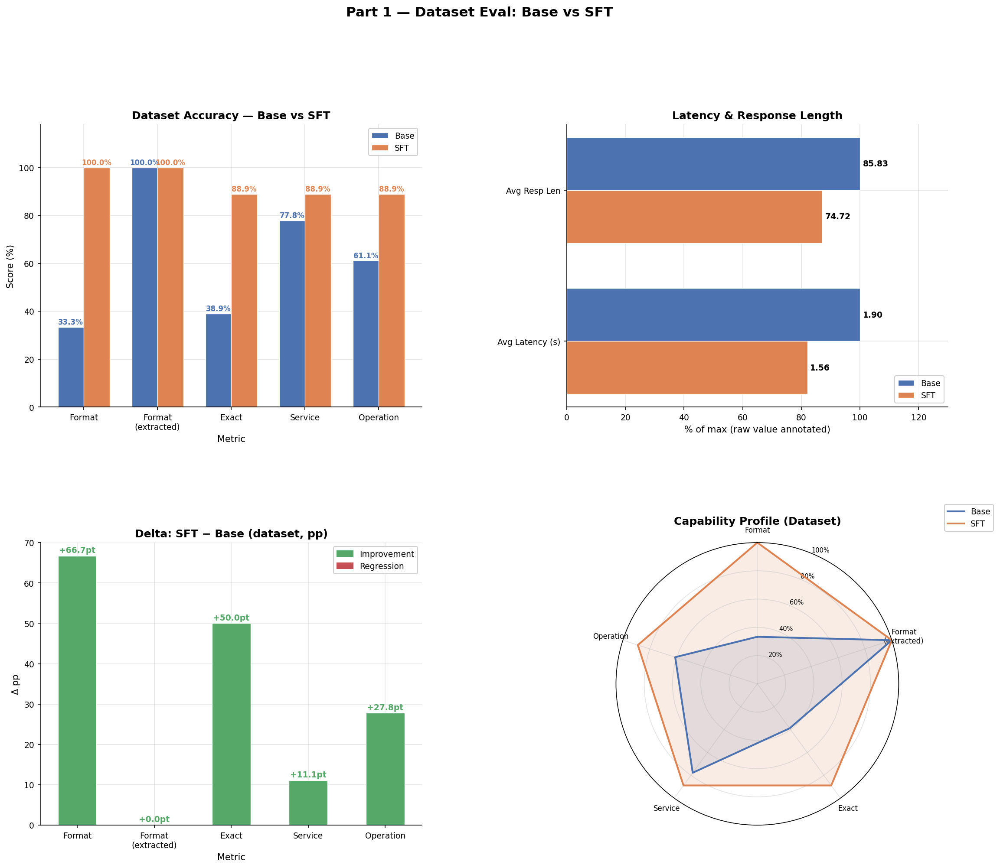
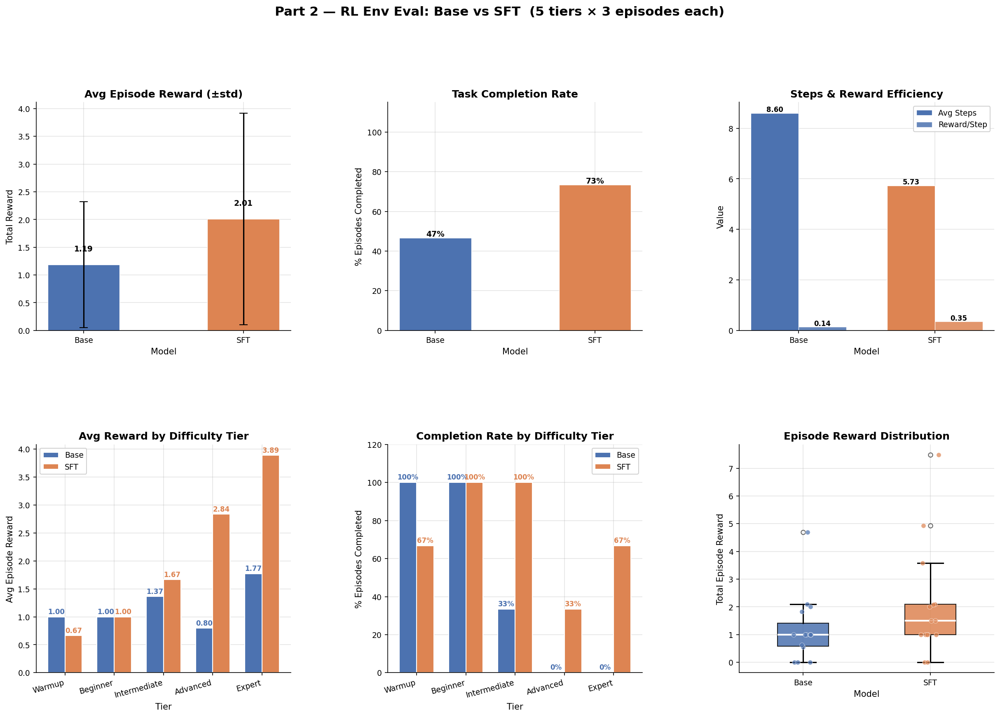
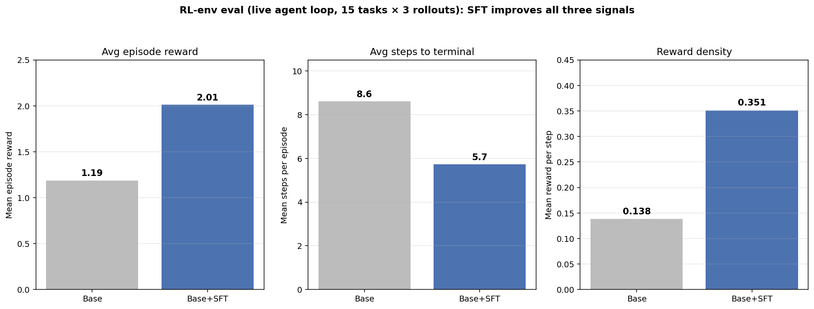

# `compare/` — Base Model vs SFT Adapter Benchmark

[← back to main README](../README.md)

This directory holds the side-by-side benchmark that answers the only question that ultimately matters: **did SFT actually make the model better at the task?**

The benchmark compares the base [Qwen2.5-Coder-3B-Instruct](https://huggingface.co/unsloth/Qwen2.5-Coder-3B-Instruct-bnb-4bit) against our published SFT adapter [Sizzing/aws-rl-sft-qwen25coder3b-adapter](https://huggingface.co/Sizzing/aws-rl-sft-qwen25coder3b-adapter) under two evaluation modes — fast static dataset eval and slow live-environment eval. Both write structured metrics so the deltas are explicit.

> 
> 

---

## Table of contents

1. [What's compared](#1-whats-compared)
2. [Two evaluation modes](#2-two-evaluation-modes)
3. [Methodology](#3-methodology)
4. [Metrics reported](#4-metrics-reported)
5. [How to run](#5-how-to-run)
6. [Reading the results](#6-reading-the-results)
7. [Files in this directory](#7-files-in-this-directory)

---

## 1. What's compared

| | Base | SFT |
|---|---|---|
| **Model**          | `unsloth/Qwen2.5-Coder-3B-Instruct-bnb-4bit` | Same base + LoRA adapter |
| **Adapter**        | None                                          | `Sizzing/aws-rl-sft-qwen25coder3b-adapter` |
| **Training data**  | Pretraining + Qwen instruction tuning         | + 1,500 rows from [data/sft/aws_rl_sft.train.jsonl](../data/sft/aws_rl_sft.train.jsonl) |
| **Inference**      | Same prompt template, same temperature        | Identical                                    |

The only variable is the LoRA adapter. Same base, same prompts, same decoding parameters, same evaluation set.

---

## 2. Two evaluation modes

The notebook runs two separate evaluations because they answer different questions:

### Dataset eval (static)

| Question  | Does the model emit the *canonical* command for held-out prompts, one-shot? |
|-----------|-----------------------------------------------------------------------------|
| Speed     | Fast (~minutes)                                                             |
| Needs     | HF token + dataset access; **no env server**                                |
| Source    | [data/sft/aws_rl_sft.val.jsonl](../data/sft/aws_rl_sft.val.jsonl) (150 held-out rows) |
| Verifies  | Format correctness + command-token match against canonical                  |

This is the same kind of pattern-matching benchmark as [data/sft/MODEL_EVALUATION.md](../data/sft/MODEL_EVALUATION.md) — fast and deterministic. Useful as a regression check.

### RL env eval (live)

| Question  | Can the model actually *solve* a task end-to-end against a live environment? |
|-----------|------------------------------------------------------------------------------|
| Speed     | Slow (~tens of minutes per model)                                            |
| Needs     | Dataset eval above + a running env server (HF Space or local)                |
| Source    | Same val tasks, but exercised through `client.AwsRlEnv` round-trips          |
| Verifies  | Multi-step task completion, partial progress, reward shaping, hint usage     |

This is closer to what training optimizes for. A model can score well on dataset eval (right command on step 1) but fail RL env eval (can't recover from a step 1 typo, can't continue past the first turn). Both signals matter.

---

## 3. Methodology

### Dataset eval

1. Load `Sizzing/aws-rl-sft` dataset from HF Hub
2. For each row in `val`, build the prompt from `messages[:-1]` (system + user, drop assistant)
3. Generate the model's response (`max_new_tokens=128`, deterministic decoding)
4. **Extract the AWS CLI line**: strip markdown fences, find first line starting with `aws `
5. Score against `messages[-1].content` (the canonical assistant response):
   - Format OK (extracted line starts with `aws`)
   - Service match (same first word after `aws`)
   - Operation match (same first two words)
   - Exact match (full token-for-token equality)

This mirrors the methodology in [eval_lm_studio_models.py](../data/eval_lm_studio_models.py); the same scoring functions are reused.

### RL env eval

1. Connect to the running env at `ENV_BASE_URL` (default: an HF Space; can be overridden to local)
2. For each val task, run a full episode (up to `MAX_STEPS=15` turns):
   - Build the prompt from system + task + observation history (matches [inference.py](../inference.py))
   - Generate one AWS CLI command per turn
   - Step the environment, record `reward`, `task_achieved`, `partial_progress`
3. Aggregate per-episode metrics

The agent loop is identical to the training-time `rollout_one_episode` in [train_grpo.py](../train_grpo.py) — same prompt structure, same generation parameters, same termination logic. So the RL env eval is genuinely measuring "what would this model do during a GRPO rollout".

---

## 4. Metrics reported

### Dataset eval

| Metric         | Definition                                                |
|----------------|-----------------------------------------------------------|
| `format_ok`    | % of responses where the extracted line starts with `aws ` |
| `svc_match`    | % matching the canonical service                           |
| `op_match`     | % matching service + operation                             |
| `exact_match`  | % matching the full canonical command token-for-token      |

### RL env eval (per episode)

| Metric                  | Definition                                                       |
|-------------------------|------------------------------------------------------------------|
| `avg_episode_reward`    | Mean total reward accumulated per episode (sum of step rewards)  |
| `completion_rate`       | % of episodes ending in `task_achieved=True`                     |
| `avg_steps_to_complete` | Mean steps used by completed episodes (lower = more efficient)   |
| `avg_max_progress`      | Mean of the highest `partial_progress` reached per episode       |
| `hint_usage_rate`       | % of episodes where the agent requested at least one hint        |
| `format_failure_rate`   | % of agent commands that failed the `aws ` prefix gate           |

The notebook produces per-tier breakdowns of all six metrics so you can see where SFT helped most (typically: warmup format-locking goes from ~85% → 100%; intermediate completion goes from a small base to a meaningful fraction).

---

## 5. How to run

### Prerequisites

- HuggingFace token (`HF_TOKEN`) — needed to load the dataset and adapter
- A running env server — either:
  - Your own HF Space deployment (set `ENV_BASE_URL` accordingly), or
  - Local server: `make run` from the repo root, then `ENV_BASE_URL=http://localhost:8000`
- A GPU runtime (Colab T4 or better, A10/A100 ideal)

### Notebooks

| Notebook                                                            | Open in Colab                  |
|---------------------------------------------------------------------|--------------------------------|
| [compare_base_vs_sft.ipynb](compare_base_vs_sft.ipynb) (clean)      | <!-- TODO: paste Colab URL --> |
| [compare_base_vs_sft_with_outputs.ipynb](compare_base_vs_sft_with_outputs.ipynb) (with outputs) | <!-- TODO: paste Colab URL --> |

The two notebooks are functionally identical; the second has cell outputs preserved (18 display widgets, 26 stdout cells) for offline inspection.

### Running steps

1. Open the notebook in Colab (or local Jupyter)
2. Edit the **CONFIG** cell:
   ```python
   BASE_MODEL        = "unsloth/Qwen2.5-Coder-3B-Instruct-bnb-4bit"
   SFT_ADAPTER_REPO  = "Sizzing/aws-rl-sft-qwen25coder3b-adapter"
   DATASET_REPO      = "Sizzing/aws-rl-sft"
   ENV_BASE_URL      = "https://your-hf-space.hf.space"   # or local
   ```
3. Run all cells. Part 1 (dataset eval) finishes first; Part 2 (RL env eval) is the slow one.
4. Compare the per-metric deltas between base and SFT.

---

## 6. Reading the results

### Actual numbers from the run

From the saved outputs of [compare_base_vs_sft_with_outputs.ipynb](compare_base_vs_sft_with_outputs.ipynb):

#### Dataset eval

| Metric                    | Base   | Base + SFT | Δ          |
|---------------------------|:------:|:----------:|:----------:|
| `format_pct`              | 33.3%  | **100.0%** | **+66.7 pp** |
| `format_after_extract_pct`| 100.0% | 100.0%     | 0          |
| `exact_pct`               | 38.9%  | **88.9%**  | **+50.0 pp** |

#### RL env eval (live multi-step agent loop)

| Metric                  | Base  | Base + SFT | Δ         |
|-------------------------|:-----:|:----------:|:---------:|
| `avg_episode_reward`    | 1.187 | **2.011**  | **+0.824** |
| `reward_std`            | 1.137 | 1.908      | +0.771    |
| `avg_steps`             | 8.600 | **5.733**  | **−2.867** |
| `avg_reward_per_step`   | 0.138 | **0.351**  | **+0.213** |

> 

The agent **earns more reward per episode while taking fewer steps** — exactly what good fine-tuning should produce. Reward-per-step jumps 2.5× because (a) the agent picks the right command more often (fewer wasted steps), and (b) format compliance is now perfect (no more `aws help` fallbacks).

#### Per-tier success in the RL eval

From the notebook's per-rollout traces (3 episodes per tier × 5 tiers = 15 episodes per model):

| Tier         | Base (rollouts ✓ / 3) | Base + SFT (rollouts ✓ / 3) |
|--------------|:---------------------:|:----------------------------:|
| warmup       | 3                     | 3                            |
| beginner     | 3                     | 3                            |
| intermediate | 1                     | 3                            |
| advanced     | 0                     | 1                            |
| expert       | 0                     | 2                            |

SFT moves the **success frontier** up two tiers — the base model could not finish a single advanced or expert episode, while SFT completes 2 of 3 expert tasks (S3 lockdown, IAM least-privilege variants) within 5 steps.

### What counts as a meaningful delta?

The val set is small (150 rows / ~10 unique tasks per RL eval), so individual percentage points have meaningful noise. Rules of thumb:

| Delta size | Significance                                   |
|------------|------------------------------------------------|
| ±2pp       | Within noise — don't claim improvement         |
| 5–10pp     | Likely real, look at per-tier breakdown        |
| >10pp      | Almost certainly real                          |

The deltas above (66.7 pp, 50.0 pp on dataset; 0.82 reward / −2.9 steps on RL eval) are well above the noise floor.

### Going further with GRPO

Once the SFT adapter is in hand, the same comparison can be re-run against the GRPO adapter (`out_grpo/grpo_adapter/`). Multi-step results from the GRPO run are documented in the [main README §11](../README.md#11-results--benchmarks); the short version is GRPO@35-steps preserves SFT performance and modestly improves the middle tiers, while the expert tier remains the bottleneck.

---

## 7. Files in this directory

| File                                                                                                | Purpose                                                          |
|-----------------------------------------------------------------------------------------------------|------------------------------------------------------------------|
| [compare_base_vs_sft.ipynb](compare_base_vs_sft.ipynb)                                              | Side-by-side dataset + RL env benchmark — clean version          |
| [compare_base_vs_sft_with_outputs.ipynb](compare_base_vs_sft_with_outputs.ipynb)                    | Same notebook with cell outputs preserved (18 display widgets)   |

---

## See also

- [Main README](../README.md) — top-level overview, results section
- [data/README.md](../data/README.md) — dataset that drives this comparison
- [data/sft/MODEL_EVALUATION.md](../data/sft/MODEL_EVALUATION.md) — base-model selection benchmark (same scoring functions reused here)
- [train/README.md](../train/README.md) — how the SFT adapter being benchmarked here was produced
- [inference.py](../inference.py) — single-model agent loop (the prototype the RL eval mode is modeled after)
