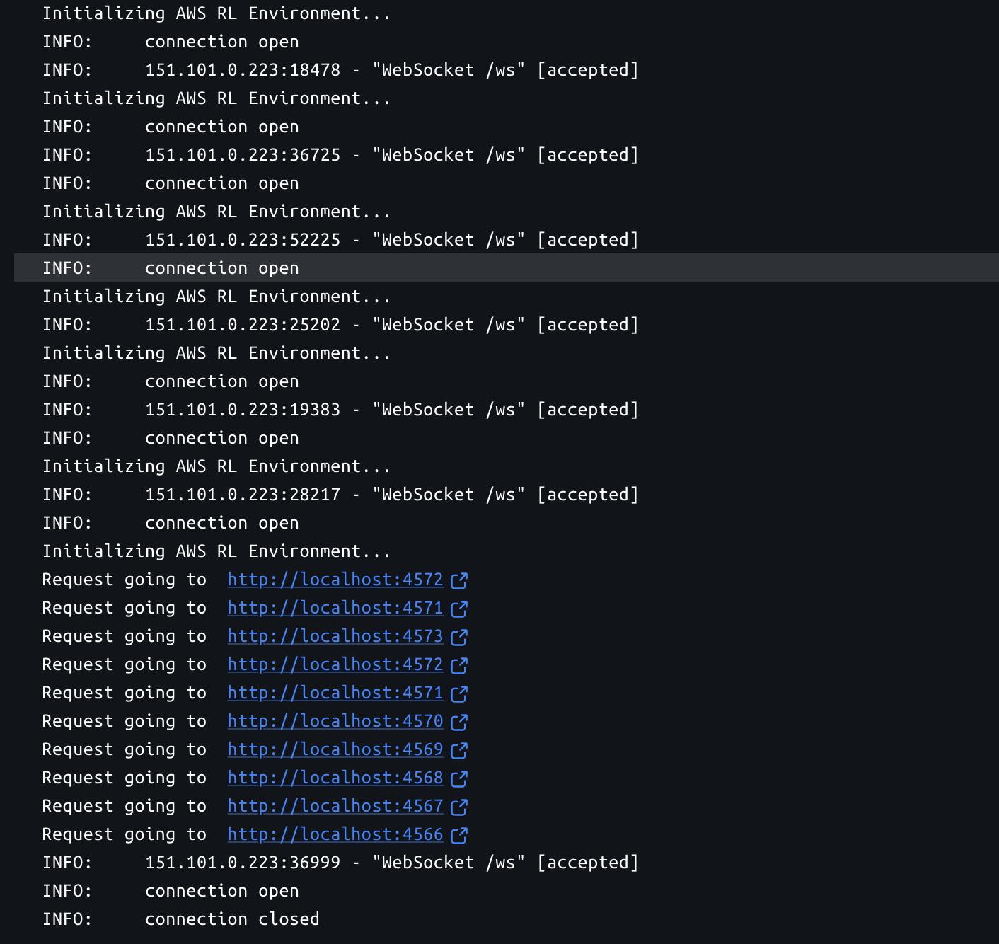
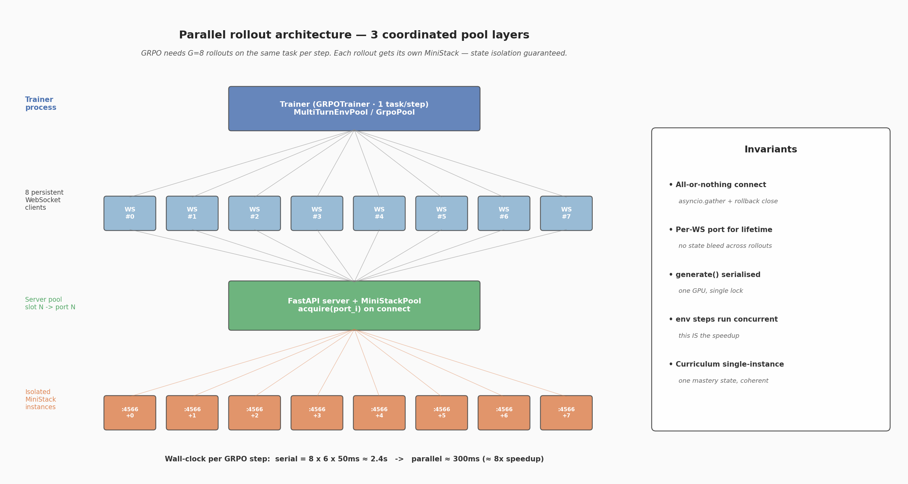

# `scripts/` — Parallel Rollout Architecture

[← back to main README](../README.md)

This directory holds the helper modules that make **8 concurrent multi-turn rollouts** against the AWS RL environment possible — the scaling trick that turns GRPO from a thought experiment into something you can actually train on a single GPU.

If you only read one section, read [§2 — Three coordinated pool layers](#2-three-coordinated-pool-layers). It explains the architecture in one page.

---

## Table of contents

1. [Why parallel rollouts matter](#1-why-parallel-rollouts-matter)
2. [Three coordinated pool layers](#2-three-coordinated-pool-layers)
3. [Walking through one GRPO step](#3-walking-through-one-grpo-step)
4. [The all-or-nothing connect protocol](#4-the-all-or-nothing-connect-protocol)
5. [Concurrency-safety guarantees](#5-concurrency-safety-guarantees)
6. [Configuration](#6-configuration)
7. [Running the multi-connection demo](#7-running-the-multi-connection-demo)
8. [Files in this directory](#8-files-in-this-directory)

---

## 1. Why parallel rollouts matter

GRPO computes **group-relative advantages**: every gradient step needs `G` rollouts on the *same* prompt so the algorithm can normalize rewards within the group. With `G = 8`, multi-turn episodes (≤ 6 turns), and an env step that round-trips an AWS CLI invocation through MiniStack (~50 ms), the math is:

```
Serial:    8 rollouts  ×  6 turns  ×  50 ms  =  2,400 ms env-time per GRPO step
Parallel: max(8 envs)  ×  6 turns  ×  50 ms  =    300 ms env-time per GRPO step
```

That's an 8× speedup on the env side. The model forward pass still serialises (single GPU), so the practical end-to-end gain depends on the env/compute ratio — but for an env that takes ~50 ms per step, parallelism is the difference between a tractable training run and a 24-hour one.

The parallelism isn't free: each rollout needs **state isolation**. If two rollouts share an AWS world, rollout 1's S3 buckets bleed into rollout 2's view, the curriculum mastery numbers go to garbage, and the agent can hack the reward by piggy-backing off siblings. The three coordinated pools below exist to make state isolation cheap and automatic.

> 

---

## 2. Three coordinated pool layers

> 

The system has **three pools** that work together. They look similar at first glance — all of them deal with N concurrent envs — but each operates at a different layer of the stack:

```
┌─────────────────────────────────────────────────────────────────────────────┐
│  Layer 3 — Trainer-process pool                                             │
│  MultiTurnEnvPool       (train_grpo.py)                                     │
│  • owns a background asyncio loop                                           │
│  • exposes a sync run_group() that the GRPO trainer can call                │
│  • used by the in-process trainer (CLI: python train_grpo.py)               │
└────────────────────────────────────┬────────────────────────────────────────┘
                                     │ N WebSocket clients
┌────────────────────────────────────▼────────────────────────────────────────┐
│  Layer 3 alt — Notebook-friendly pool                                       │
│  GrpoPool               (scripts/grpo_pool.py)                              │
│  • async-native API (async with GrpoPool(...) as pool: ...)                 │
│  • used by Colab notebooks where the cell IS the asyncio loop               │
│  • simpler interface (no background thread)                                 │
└────────────────────────────────────┬────────────────────────────────────────┘
                                     │ N WebSocket clients
┌────────────────────────────────────▼────────────────────────────────────────┐
│  Layer 2 — OpenEnv max_concurrent_envs                                      │
│  create_app(env_factory, ..., max_concurrent_envs=POOL_SIZE)                │
│  • OpenEnv reserves up to N env instances at once                           │
│  • returns 503 if a 9th client tries to connect when POOL_SIZE=8            │
└────────────────────────────────────┬────────────────────────────────────────┘
                                     │ env_factory() invoked per session
┌────────────────────────────────────▼────────────────────────────────────────┐
│  Layer 1 — Server-side MiniStack pool                                       │
│  MiniStackPool          (server/app.py)                                     │
│  • free-list of MiniStack ports (BASE..BASE+POOL_SIZE-1)                    │
│  • acquire()/release() under a threading.Lock                               │
│  • each WS session binds to ONE port for its lifetime → state isolation     │
└─────────────────────────────────────────────────────────────────────────────┘
                                     │
                                     ▼
                     N independent MiniStack processes
                     (started by Dockerfile / Makefile)
```

### Layer 1 — Server-side `MiniStackPool`

Lives in [server/app.py:75–138](../server/app.py). Documented in detail in [server/README.md §6](../server/README.md#6-server-side-ministack-pool-parallel-rollouts).

- A `threading.Lock`-guarded free list of port numbers
- `acquire()` returns a port; `release(port)` puts it back
- `RuntimeError("MiniStack pool exhausted")` if depleted
- The Dockerfile launches `POOL_SIZE` MiniStack processes on consecutive ports before the FastAPI server starts accepting connections

### Layer 2 — OpenEnv `max_concurrent_envs`

When `create_app()` is called with `max_concurrent_envs=POOL_SIZE`, OpenEnv enforces the cap upstream — clients beyond the cap get a clean 503 instead of `RuntimeError`. Defence in depth.

### Layer 3 — Client pools

Two flavours, same parallelism model, different ergonomics:

| | `MultiTurnEnvPool` ([train_grpo.py](../train_grpo.py)) | `GrpoPool` ([scripts/grpo_pool.py](grpo_pool.py)) |
|---|---|---|
| API | Sync — `pool.run_group(task, ...)` | Async — `await pool.run_group(rollout_fn)` |
| Loop | Owns a background thread + asyncio loop | Caller is the asyncio loop (Colab cell) |
| Use case | In-process trainer (`python train_grpo.py`) | Notebooks driving training from Colab |
| Connection | `await asyncio.gather(*(e.connect() for e in envs))` on background thread | Same, but on the caller's loop |
| `record_result()` | Trainer calls `Curriculum.record_result()` directly | `pool.record_group_result(task, rewards)` helper baked in |

Both share the **all-or-nothing connect protocol** described in §4.

### Why two client pools?

Real life: the trainer process (`python train_grpo.py`) runs synchronously — TRL's `GRPOTrainer.train()` blocks. To use `await asyncio.gather` from inside that, we need a background asyncio loop on a separate thread. That's `MultiTurnEnvPool`.

Colab cells, on the other hand, *are* the asyncio loop (Jupyter ≥ 7 ships nest_asyncio under the hood). Running a background thread + loop there is overkill and creates ordering bugs. `GrpoPool` is the simpler async-native variant for that case.

The two pools share semantic invariants — same N, same all-or-nothing connect, same task scoping — so behaviour is identical regardless of which entry point you use.

---

## 3. Walking through one GRPO step

```
1. trainer picks one task from the Curriculum                  (1 task)
2. pool.run_group(task)                                        (asyncio.gather over N envs)
3. for turn in 0..MAX_TURNS:
       prompts = build_prompts(observations)                   (CPU)
       completions = policy.generate(prompts)                  (1 batched fwd, GPU)
       actions = parse_completions(completions)                (CPU; extract `aws ...` line)
       observations = await pool.run_group_step(actions)       (N concurrent env.step)
4. rewards = sum_per_episode(rewards_lists)                    (N floats)
5. GRPO computes group-relative advantages, KL, loss           (1 backward, GPU)
6. Curriculum.record_result(task, mean(rewards))               (1 update)
```

A couple of subtleties:

### Generation is serialised, env-step is not

[train_grpo.py:_GENERATE_LOCK](../train_grpo.py) — a `threading.Lock` around `model.generate()`. The model lives on a single GPU; concurrent `generate()` calls would clobber each other. We let env step calls run concurrently (the slow part — WebSocket round-trip + MiniStack execution); only generation serialises.

### Per-turn token accumulation

`rollout_one_episode()` accumulates `prompt_ids`, `completion_ids`, and `logprobs` across turns into a single sequence. GRPO then assigns the episode-level reward to that full sequence. This matches the multi-turn structure of the underlying decision problem.

### Why every rollout in a group runs the same task

GRPO's group-relative advantage is `(reward_i − group_mean) / group_std`. If different rollouts ran different tasks, group statistics would mean nothing. The curriculum picks one task per GRPO step; the pool's `reset_group(task)` forces every env to that task; only then can the group statistics be meaningful.

---

## 4. The all-or-nothing connect protocol

[scripts/grpo_pool.py:58-82](grpo_pool.py) — the most non-obvious correctness detail in the whole pool stack.

```python
async def connect(self) -> None:
    if self.envs:
        return
    envs = [AwsRlEnv(base_url=self.base_url) for _ in range(self.size)]
    try:
        await asyncio.gather(*(e.connect() for e in envs))
    except BaseException:
        # Roll back: close every env (successful or not). return_exceptions
        # so a close() failure doesn't mask the original connect error.
        await asyncio.gather(
            *(e.close() for e in envs),
            return_exceptions=True,
        )
        raise
    # Only publish the pool after the entire group connected successfully.
    self.envs = envs
```

What makes this important:

1. **`asyncio.gather` raises on the first failure**. If 3 of 8 connects succeed and the 4th raises, the other 4 may or may not have connected yet. Their state is undefined.
2. **Server-side state matters**. Each successful connect acquired a MiniStack port from the server pool. If we just `raise` without cleanup, those ports stay held until the WebSocket times out — typically minutes. The next training run hits "pool exhausted".
3. **`self.envs` is published only after success**. If any partial state were exposed, callers might call `pool.run_group()` on a half-initialised pool and get N/M valid results.
4. **`return_exceptions=True` on the rollback**. A close error must not mask the original connect error — the user needs to know the *real* reason connect failed, not a downstream cleanup failure.

These four invariants are the difference between "training reliably resumes after a flake" and "every flake leaks 7 ports and you're rebuilding the container at 3 AM".

`MultiTurnEnvPool._connect_all()` in [train_grpo.py:473-480](../train_grpo.py) implements the same pattern.

---

## 5. Concurrency-safety guarantees

| Concern                       | Guarantee                                                                                   | Where enforced                                            |
|------------------------------|---------------------------------------------------------------------------------------------|-----------------------------------------------------------|
| Cross-rollout state isolation | Each WebSocket session holds its own MiniStack port for its lifetime                        | `MiniStackPool.acquire/release` ([server/app.py](../server/app.py)) |
| Curriculum coherence          | One curriculum instance per training run; `record_result()` is the only mutation point     | `make_rollout_func` in [train_grpo.py](../train_grpo.py)  |
| GPU contention                | `model.generate()` calls serialised behind `_GENERATE_LOCK`                                 | [train_grpo.py:_GENERATE_LOCK](../train_grpo.py)          |
| Pool slot leakage on flake    | All-or-nothing connect with rollback close                                                  | `GrpoPool.connect`, `MultiTurnEnvPool._connect_all`       |
| Hung shutdown                 | Pool close runs `asyncio.gather(..., return_exceptions=True)` then stops the loop with timeout | `MultiTurnEnvPool.close()`                              |
| Web playground vs pool collisions | Web routes refuse to mount when `POOL_SIZE > 1`                                          | [server/app.py:171](../server/app.py)                     |

Tests covering these:

- [tests/test_pool.py](../tests/test_pool.py) — server-side `MiniStackPool` acquire/release, exhaustion behaviour
- [tests/test_grpo_pool.py](../tests/test_grpo_pool.py) — `GrpoPool` connect/close lifecycle, partial-connect rollback, group-result aggregation

---

## 6. Configuration

| Variable                            | Default | Purpose                                                                             |
|-------------------------------------|---------|-------------------------------------------------------------------------------------|
| `AWS_RL_ENV_POOL_SIZE`              | `1`     | Server-side MiniStack pool size. Set to `8` for GRPO training. Must be ≥ training-time `num_generations`. |
| `AWS_RL_ENV_MINISTACK_BASE_PORT`    | `4566`  | First MiniStack port; the pool covers `[BASE, BASE + POOL_SIZE)`                    |
| `BACKEND_TYPE`                      | `simulator` | `simulator` (default; pool is meaningful) or `aws` (real AWS; pool disabled)    |
| `NUM_GENERATIONS` (in trainer cfg)  | `8`     | Number of WebSocket clients the pool opens. Should equal `AWS_RL_ENV_POOL_SIZE` for full parallelism. |
| `MAX_TURNS` (in trainer cfg)        | `6`     | Per-rollout episode length cap                                                      |
| `MAX_TOTAL_TOKENS` (in trainer cfg) | `4096`  | Per-episode token budget (anti-OOM)                                                 |

When deploying to HuggingFace Spaces, pool size is constrained by container memory — each MiniStack process is ~50–100 MB resident.

---

## 7. Running the multi-connection demo

[scripts/TestMultipleConnects.ipynb](TestMultipleConnects.ipynb) is a hands-on notebook that proves all 8 sessions stay isolated.

```bash
# 1. Start the env server with pool size 8
AWS_RL_ENV_POOL_SIZE=8 make run

# 2. Run the notebook
jupyter notebook scripts/TestMultipleConnects.ipynb
```

Expected output: 8 simultaneous "connection open" lines, 8 independent reset/step traces, no resource bleed across sessions.

The screenshot at [docs/figures/env_init_screenshot.png](../docs/figures/env_init_screenshot.png) captures one such run.

---

## 8. Files in this directory

| File                                                  | Purpose                                                                  |
|-------------------------------------------------------|--------------------------------------------------------------------------|
| [grpo_pool.py](grpo_pool.py) (139 LOC)                | Async-native `GrpoPool` — N persistent WebSockets, `asyncio.gather`, all-or-nothing connect, group-result aggregation |
| [grpo_train.py](grpo_train.py) (~430 LOC)             | Alternative training entry point that uses `GrpoPool` directly (vs `train_grpo.py` which embeds `MultiTurnEnvPool`) |
| [TestMultipleConnects.ipynb](TestMultipleConnects.ipynb) | Hands-on demo proving 8 concurrent WebSockets stay isolated           |

Related code outside this directory:

- [train_grpo.py](../train_grpo.py) — `MultiTurnEnvPool` class, the canonical in-process pool
- [server/app.py](../server/app.py) — `MiniStackPool`, `make_env_factory`, the server-side pool layer
- [client.py](../client.py) — `AwsRlEnv` WebSocket client used by both pools
- [tests/test_pool.py](../tests/test_pool.py), [tests/test_grpo_pool.py](../tests/test_grpo_pool.py) — concurrency tests

---

## See also

- [Main README](../README.md) — project overview
- [server/README.md](../server/README.md) — environment internals (server-side pool detail in §6)
- [train/README.md](../train/README.md) — SFT + GRPO training pipeline (this pool plugs into the GRPO loop)
- [tests/test_pool.py](../tests/test_pool.py) — server-side pool acquire/release tests
- [tests/test_grpo_pool.py](../tests/test_grpo_pool.py) — client-side pool lifecycle tests
