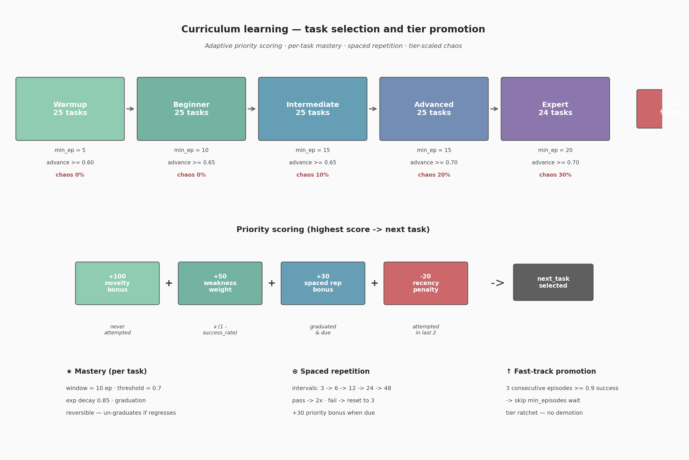

# `server/` — AWS RL Environment Internals

[← back to main README](../README.md)

This directory implements the **OpenEnv-compatible FastAPI server** that powers the AWS RL Environment. The server exposes HTTP and WebSocket endpoints to a training agent, executes AWS CLI commands against a backing simulator (or real AWS), runs a reward / curriculum stack, and returns shaped observations.

If you only have time for the headline numbers, read [the main README](../README.md). This document is the reference for **how** the environment actually works — every defended invariant, every edge case, every config knob.

---

## Table of contents

1. [Architecture overview](#1-architecture-overview)
2. [HTTP / WebSocket endpoints](#2-http--websocket-endpoints)
3. [Episode lifecycle](#3-episode-lifecycle)
4. [Strategy pattern: Simulator vs Real AWS](#4-strategy-pattern-simulator-vs-real-aws)
5. [MiniStack: vendored fork & customizations](#5-ministack-vendored-fork--customizations)
6. [Server-side MiniStack pool (parallel rollouts)](#6-server-side-ministack-pool-parallel-rollouts)
7. [Curriculum manager](#7-curriculum-manager)
8. [Reward shaping & TaskGrader](#8-reward-shaping--taskgrader)
9. [Anti-reward-hacking — 8 defense layers](#9-anti-reward-hacking--8-defense-layers)
10. [Resource verifier](#10-resource-verifier)
11. [Chaos engine](#11-chaos-engine)
12. [Drift engine](#12-drift-engine)
13. [Hint provider](#13-hint-provider)
14. [Episode tracker](#14-episode-tracker)
15. [Environment designer](#15-environment-designer)
16. [Task definitions (YAML schema)](#16-task-definitions-yaml-schema)
17. [Security-posture audit examples](#17-security-posture-audit-examples)
18. [Curriculum stats API](#18-curriculum-stats-api)
19. [Web playground](#19-web-playground)

---

## 1. Architecture overview

```
┌──────────────────────────────── server/ process ────────────────────────────────┐
│                                                                                 │
│   FastAPI app  (server/app.py)                                                  │
│   ├── OpenEnv router  /reset  /step  /state  /schema  /ws  /health              │
│   ├── Web router      /web  /web/reset  /web/step  /web/state  /web/solution    │
│   └── env_factory ──► AwsRlEnvironment(strategy=…)                              │
│                          │                                                      │
│                          ├── EpisodeTracker          (per-episode state)        │
│                          ├── Curriculum              (priority + mastery)       │
│                          ├── EnvironmentDesigner     (setup commands)           │
│                          ├── HintProvider            (3-level hints)            │
│                          ├── ChaosEngine             (mid-episode mutations)    │
│                          ├── DriftEngine             (drift-task injection)     │
│                          ├── TaskGrader              (5-strategy dispatcher)    │
│                          ├── ResourceVerifier        (ground-truth state)       │
│                          └── EnvironmentStrategy ──► SimulatorStrategy          │
│                                                  ╲   (talks to MiniStack)      │
│                                                   ╲  AwsStrategy               │
│                                                       (talks to real AWS)       │
└─────────────────────────────────────────────────────────────────────────────────┘
                                        │
                                        ▼
                          MiniStack process(es) on :4566+
                          (own port per pool slot when AWS_RL_ENV_POOL_SIZE > 1)
```

Files:

- [server/app.py](app.py) — FastAPI app, OpenEnv integration, MiniStack pool, web routes
- [server/aws_rl_env_environment.py](aws_rl_env_environment.py) — main `AwsRlEnvironment` orchestrator
- [server/services/](services/) — pluggable services (one concern per file, listed in §7–§16)
- [server/services/tasks/](services/tasks/) — YAML task definitions, one file per tier
- [server/templates/index.html](templates/index.html) — playground HTML
- [server/static/](static/) — playground JS/CSS, 40 AWS service icons

---

## 2. HTTP / WebSocket endpoints

OpenEnv-compatible (created via `openenv.core.env_server.http_server.create_app`):

| Method | Path     | Purpose                                                         |
|--------|----------|-----------------------------------------------------------------|
| POST   | `/reset` | Wipe infra, pick next task from curriculum, return observation  |
| POST   | `/step`  | Execute action, grade, optionally inject chaos, return obs      |
| GET    | `/state` | Full `AwsRlState` snapshot (current task, tracker, infra state) |
| GET    | `/schema`| JSON schemas for `AwsRlAction` / `AwsRlObservation`             |
| GET    | `/health`| Liveness probe                                                  |
| WS     | `/ws`    | Persistent session (one MiniStack acquired per connection)      |

Web playground (always mounted; backed by a dedicated lazy MiniStack — see §6):

| Method | Path             | Purpose                                                   |
|--------|------------------|-----------------------------------------------------------|
| GET    | `/`              | Redirect → `/web`                                         |
| GET    | `/web`           | HTML playground (Jinja2 template `index.html`)            |
| POST   | `/web/reset`     | Stateful reset for the playground's shared env            |
| POST   | `/web/step`      | Stateful step for the playground's shared env             |
| GET    | `/web/state`     | Current `AwsRlState` for the shared env                   |
| GET    | `/web/solution`  | Reveal next canonical solution command (debug aid)        |

Auto-generated docs: `/docs` (Swagger), `/redoc` (ReDoc).

---

## 3. Episode lifecycle

1. **`reset()`**
   1. `EnvironmentStrategy.reset_environment()` — wipes simulator state (no-op for real AWS)
   2. `Curriculum.next_task()` — picks the next task (see §7 priority scoring)
   3. `EnvironmentDesigner.provision(task.setup_commands)` — runs preflight CLI commands to create the broken / insecure infra the agent must fix (used by SRE, drift, security-posture tasks)
   4. `DriftEngine.inject(task)` — for drift tasks, randomly applies 2–3 mutations from `task.possible_drifts`
   5. `EpisodeTracker.start(task)` — fresh tracker
   6. Returns initial `AwsRlObservation` with the masked `TaskInfo` (task description but **not** success criteria)

2. **`step(action)`**
   1. **Validate** — only commands starting with `aws ` are accepted (see §9 layer 4)
   2. **Intercept hint requests** — `aws help --task-hint` returns next-level hint, increments `hints_used`, never reaches the simulator
   3. `EnvironmentStrategy.execute(command)` — runs the AWS CLI invocation, returns stdout / stderr / exit_code
   4. `EpisodeTracker.record(...)` — parses command, dedup-checks, updates `partial_progress`
   5. `TaskGrader.grade(...)` — returns shaped reward (see §8)
   6. `ChaosEngine.maybe_inject(...)` — at tier-scaled probability, executes a destructive mutation on a resource the agent just touched
   7. `Curriculum.record_step(...)` — accumulates step-level signal
   8. Returns updated `AwsRlObservation`

3. **Termination**
   - `obs.task_achieved == True`, **or**
   - `step_count >= MAX_STEPS` (default 15, configurable via env var)
   - On terminate: `Curriculum.record_result(task, achieved, reward)` updates per-task mastery and may promote the agent's tier

---

## 4. Strategy pattern: Simulator vs Real AWS

The environment supports two backends, swapped via the `BACKEND_TYPE` env var (default `simulator`):

### `SimulatorStrategy` — [services/simulator_strategy.py](services/simulator_strategy.py)

- Talks to a MiniStack instance over HTTP (`AWS_INFRA_URL`, default `http://localhost:4566`)
- AWS CLI invocations are subprocessed with `AWS_ENDPOINT_URL` set so they hit MiniStack
- `reset_environment()` calls MiniStack's `/_ministack/reset` endpoint to wipe state
- `get_state()` reads the **custom** `/_ministack/state` endpoint (see §5) — one HTTP call returns the entire infra inventory used by `ResourceVerifier`

### `AwsStrategy` — [services/aws_strategy.py](services/aws_strategy.py)

- Uses ambient AWS credentials (whatever the standard AWS CLI credential chain finds)
- No `AWS_ENDPOINT_URL` override — commands hit real AWS
- `reset_environment()` is a **no-op** (we cannot wipe a real AWS account; expert-level task scenarios assume a clean / sandboxed sub-account)
- Useful for end-to-end demonstrations, less so for RL training

Switching backends:

```bash
export BACKEND_TYPE=aws  # or "simulator" (default)
make run
```

The factory in [server/app.py](app.py) wires the right strategy at startup.

---

## 5. MiniStack: vendored fork & customizations

> **Why this matters:** the simulator that the grader queries is not a black-box pip dependency — it's vendored in-tree as a git subtree at [aws_infra/](../aws_infra/) so we can extend it. The custom endpoints we added there are how `ResourceVerifier` and the grader can read full infra state in a single round-trip.

### Vendored as a git subtree

`aws_infra/` was imported via `git subtree add` in commit **[`2c38c0b` "Bring mini stack to local"](../aws_infra/)** (PR #5). Upstream is the public MiniStack project. The full upstream README is preserved at [aws_infra/README.md](../aws_infra/README.md) (81 KB).

Why we vendored instead of taking a pip dependency:

1. **Custom endpoints**: we needed JSON state-introspection endpoints (`/_ministack/state`, `/_ministack/actions`) that upstream did not ship. These are the integration seams between our env grader and the simulator.
2. **Reproducible builds**: the Docker image ships a specific MiniStack revision; no runtime network fetch, identical behavior across environments.
3. **Service-coverage extensions**: occasional patches to individual service handlers (e.g. RDS state retrieval used by `ResourceVerifier`).

### Custom modifications on top of upstream

Each modification is a separate, cleanly-cherry-pickable commit so future upstream syncs are low-conflict.

| Commit    | Title                                                                                  | What it adds                                                                                                                                                |
|-----------|----------------------------------------------------------------------------------------|-------------------------------------------------------------------------------------------------------------------------------------------------------------|
| `a648c3a` | feat: Add support for service state retrieval and action listing across multiple AWS services | `/_ministack/state` returns the entire infra inventory as JSON in one call (the grader's primary read path). `/_ministack/actions` lists every supported operation per service — used by tooling and tests. |
| `a00e981` | chor: Small Fixes                                                                      | Tightening / typo fixes on top of `a648c3a`.                                                                                                                |
| `af2e945` | Sync MiniStack with latest changes                                                     | Periodic upstream sync. Replays our custom commits cleanly because they are isolated and well-scoped.                                                       |
| `579597b` | Sync MiniStack with latest changes                                                     | Subsequent upstream sync.                                                                                                                                   |

To inspect any of these:

```bash
git show a648c3a                     # see the full diff for the state endpoint
git log --oneline -- aws_infra/      # see only the aws_infra/ history
```

### Build integration

- [aws_infra/pyproject.toml](../aws_infra/pyproject.toml) declares MiniStack as its own package; we install it as an editable dependency via `make install-all`.
- The [Dockerfile](../Dockerfile) stages MiniStack explicitly so the resulting container has no external network requirement at runtime.
- The [aws_infra/Makefile](../aws_infra/Makefile) provides `make build` and `make test` targets if you want to work on MiniStack itself.
- `aws_infra/docker-compose.yml` lets you run MiniStack alone for debugging.

### Upstream sync workflow

```bash
# From the repo root
git subtree pull --prefix=aws_infra <upstream-remote> main --squash
# Resolve any conflicts (rare, because our patches live in identifiable commits)
# Test:
pytest tests/ -k "verifier or grader"
```

---

## 6. Server-side MiniStack pool (parallel rollouts)

> **Why:** GRPO training generates `G=8` rollouts per step on the same task and computes group-relative advantages. To run those 8 rollouts truly in parallel **without state bleed**, every rollout needs its own AWS world. The server-side pool makes that possible.

### Design — [server/app.py:75–138](app.py)

When the server boots, `make_env_factory(POOL_SIZE, BASE_PORT, BACKEND_TYPE)` decides which factory to install:

| Mode                                            | What gets created                                                              |
|-------------------------------------------------|--------------------------------------------------------------------------------|
| `BACKEND_TYPE=aws`                              | No pool. All sessions share `AwsStrategy`. Pool would be meaningless on real AWS. |
| `AWS_RL_ENV_POOL_SIZE=1` (default)              | No pool object; one shared `SimulatorStrategy` on the default port.            |
| `AWS_RL_ENV_POOL_SIZE=N` (`N>1`, simulator)     | A `MiniStackPool` (thread-safe free-list of ports `BASE..BASE+N-1`). Each WebSocket session calls `pool.acquire()` to get its own MiniStack port; on disconnect `env.close()` triggers `pool.release(port)`. |

The pool's `acquire()` raises `RuntimeError("MiniStack pool exhausted")` if a 9th client tries to connect when `POOL_SIZE=8`. OpenEnv's `create_app(..., max_concurrent_envs=POOL_SIZE)` enforces the same cap upstream so callers see a clean 503 instead.

### The Dockerfile launches N MiniStacks

The container's entrypoint starts `POOL_SIZE` MiniStack processes on ports `4566..4566+POOL_SIZE-1` before the FastAPI server is ready to accept connections. Each MiniStack runs the same image but has its own in-memory state — so the 8 rollouts cannot accidentally see each other's S3 buckets, IAM roles, etc.

### Web playground gets its own MiniStack (lazy, on a constant port)

The pool owns `[BASE..BASE+N-1]` for WebSocket sessions. The web playground's shared `_env` cannot share those ports — a `/web/step` would clobber whichever rollout currently holds the same MiniStack. Instead, the web UI uses a **dedicated MiniStack on a constant port outside the pool's range** (`AWS_RL_ENV_WEB_MINISTACK_PORT`, default `4565`). The pool is constructed as `range(BASE, BASE+N)`, so `pool.acquire()` can never hand out the web port.

That dedicated MiniStack is **spawned lazily** by the FastAPI server on the first `/web/*` request (`subprocess.Popen(["ministack", "-d"], env={"GATEWAY_PORT": "4565", ...})`). Training-only deployments — the common case — pay zero cost: the extra MiniStack only exists if a user actually opens the playground. First request takes ~1–3s for the bind; subsequent requests are fast (cached `_env`). A startup assertion refuses to boot if `AWS_RL_ENV_WEB_MINISTACK_PORT` falls inside the pool's range.

`POOL_SIZE=1` keeps the legacy single-MiniStack path: the web env shares `:4566` with the lone pool MiniStack — no extra process, no extra port.

### Configuration

| Env var                            | Default | Purpose                                                       |
|------------------------------------|---------|---------------------------------------------------------------|
| `AWS_RL_ENV_POOL_SIZE`             | `1`     | Number of MiniStack instances + WebSocket session capacity    |
| `AWS_RL_ENV_MINISTACK_BASE_PORT`   | `4566`  | First MiniStack port; pool covers `[BASE, BASE + N)`          |
| `AWS_RL_ENV_WEB_MINISTACK_PORT`    | `4565`  | Web playground's dedicated MiniStack port (lazy spawn; must lie outside the pool's range when `POOL_SIZE>1`) |
| `BACKEND_TYPE`                     | `simulator` | `simulator` (default, MiniStack) or `aws` (real AWS, pool disabled) |

### Cross-link

The **client side** of this pool — the `GrpoPool` and `MultiTurnEnvPool` that open N persistent WebSocket connections and run rollouts concurrently — is documented in [scripts/README.md](../scripts/README.md). Read that doc for the full multi-turn + multi-rollout walkthrough.

---

## 7. Curriculum manager

> 

[services/curriculum.py](services/curriculum.py) — 536 LOC. Adaptive task selection with mastery tracking, spaced repetition, and tier promotion.

### Per-tier configuration

| Tier         | min_episodes | advance_rate | mastery_window | mastery_threshold | fast_track_rate | chaos_probability |
|--------------|:------------:|:------------:|:--------------:|:-----------------:|:---------------:|:-----------------:|
| warmup       | 5            | 0.6          | 10             | 0.7               | 0.9             | 0.0               |
| beginner     | 10           | 0.65         | 10             | 0.7               | 0.9             | 0.0               |
| intermediate | 15           | 0.65         | 10             | 0.7               | 0.9             | 0.10              |
| advanced    | 15           | 0.7          | 10             | 0.7               | 0.9             | 0.20              |
| expert       | 20           | 0.7          | 10             | 0.7               | 0.9             | 0.30              |

### Priority scoring

For each episode the curriculum picks the highest-scored task within the agent's current tier:

```
score = novelty_bonus          # +100 if never attempted
      + weakness_weight        # +50 × (1 − task_success_rate)
      + spaced_rep_bonus       # +30 if a graduated task is "due" for re-test
      − recency_penalty        # −20 if attempted in the last 2 episodes
```

This single formula simultaneously enforces exploration (novelty), targets weak spots (weakness), prevents forgetting (spaced rep), and avoids rut behavior (recency). No hand-coded scheduling — it falls out of the score.

### Mastery model

- **Window**: the last 10 episodes for each task
- **Threshold**: a task graduates when its weighted success rate crosses 0.7
- **Decay**: `0.85` exponential — recent results count for more
- **Un-graduation**: if a graduated task drops back below threshold, it loses graduation and re-enters the rotation

### Spaced repetition

Graduated tasks resurface at intervals `[3, 6, 12, 24, 48]` episodes. Pass on re-test → interval doubles (capped at 48). Fail → interval resets to 3. The `+30` priority bonus in the scoring formula is what surfaces them.

### Tier promotion

Two paths:

- **Standard**: `tier_episodes >= min_episodes` and `tier_success_rate >= advance_rate`
- **Fast-track**: 3 consecutive episodes at ≥ `fast_track_rate` (0.9) — bypasses the minimum

Demotion is **not** supported — the agent's "ratchet" only goes up. (Mastery on individual tasks does decay; the *tier* does not.)

### Notable APIs

- `Curriculum.next_task() -> Task` — selection
- `Curriculum.record_result(task, achieved, reward)` — episode-level callback
- `Curriculum.get_task_by_id(task_id) -> Task` — used by the GRPO validation harness for frozen held-out tasks
- `Curriculum.get_stats() -> dict` — see §18

---

## 8. Reward shaping & TaskGrader

[services/task_grader.py](services/task_grader.py) — 264 LOC. The grader is the single source of reward truth.

### Reward formula

```
if task_achieved:
    reward = 1.0
    if survived_chaos:    reward *= 1.05      # ≤ 1.05 cap
else:
    reward = partial_progress * 0.8           # ≤ 0.8 from steps alone
    if progress_increased: reward += 0.1      # dense progress signal
    if command_failed:     reward *= 0.5      # error penalty
    reward -= 0.1 * rollback_count            # create→delete pairs
    reward += 0.02 * idempotent_retries       # graceful "already exists"
    reward = clamp(reward, 0.0, 0.99)         # 1.0 reserved for completion

reward *= 0.85 ** hints_used                  # hint decay applied last
```

This is **dense by design** — the agent gets meaningful feedback on every step, not just at episode end.

### Five grading strategies (dispatcher pattern)

`TaskGrader.grade()` dispatches on `task.success_criteria.grading_strategy`:

| Tier         | Strategy                  | Mechanism                                                                                  | Partial-progress source              |
|--------------|---------------------------|--------------------------------------------------------------------------------------------|--------------------------------------|
| Warmup       | `command_match`           | Latest command contains correct service + operation                                        | Binary 0 or 1.0                      |
| Beginner     | `resource_creation`       | Command match (0.5) + `ResourceVerifier` confirms exact resource exists in state (1.0)      | Two-stage (0.5 → 1.0)                |
| Intermediate | `multi_step`              | Ordered list of `(operation, resource)` pairs; credit each new step                         | `completed_steps / total_steps`      |
| Advanced     | `multi_step + services`   | Same as multi_step **and** all `services_required` must be touched                          | `completed_steps / total_steps` (capped until services satisfied) |
| Expert       | `state_checks`            | `ResourceVerifier` runs arbitrary AWS CLI commands at grading time and asserts on output   | `0.7 × steps + 0.3 × state_checks`   |

State-check assertions support two forms:
- `output_contains: <substring>` — substring match on stdout
- `json_path: <jq-style path>` + `expected: <value>` — JSON extraction with expected value

This per-tier polymorphism is critical: a single grading rule would be too lax for warmup or too crude for SRE tasks.

### Chaos survival bonus

If `ChaosEngine` injected a mutation during the episode and the agent still completed, reward is `1.05` instead of `1.0` (5% bonus) — and that bonus *stacks under* hint decay (so the agent that solves a chaotic task without hints gets the maximum).

### Rollback penalty & idempotency bonus

- **Rollback** (`-0.1` per pair): `EpisodeTracker.detect_rollbacks()` scans the command history for `(create-X, … , delete-X)` pairs on the same resource. Production-style waste — heavily penalized.
- **Idempotency** (`+0.02`): if a command fails with a known "already exists" pattern (`BucketAlreadyExists`, `ResourceInUseException`, etc.) and the next command continues productively, the agent is rewarded for graceful retry behavior.

This is the first RL environment we know of that rewards *operational discipline* directly.

---

## 9. Anti-reward-hacking — 8 defense layers

The agent's only loss surface is the reward signal. We harden it so that the cheapest path to a high reward is *actually doing the task* — not gaming the grader.

### Layer 1 — Ground-truth verification via MiniStack

The grader **never trusts agent command output**. For every resource check it asks `ResourceVerifier` to query MiniStack (or AWS) directly. Even if the agent crafts a perfectly-formed fake JSON response, the grader looks at server-side state.

> ResourceVerifier covers 20+ services with bespoke verification methods (S3, DynamoDB, Lambda, SQS, SNS, IAM, Secrets Manager, API Gateway, Cognito, RDS, EFS, ElastiCache, EC2, Step Functions, Glue, Athena, EMR, ECS, EKS, EventBridge, Kinesis, …).

### Layer 2 — Deduplication

`EpisodeTracker.has_executed_operation()` records every `(operation, resource)` pair that earned credit. Re-running the same successful command does **not** re-earn `partial_progress`. Each unique operation pays out exactly once.

### Layer 3 — Grader invisibility

The CLI commands run by `ResourceVerifier` and `state_checks` happen **server-side** and are not echoed into the agent's observation. The agent never sees which queries the grader is making, so it cannot reverse-engineer "fake outputs" that match the grader's expectations.

### Layer 4 — Command allow-listing

`step()` rejects anything that doesn't start with `aws ` (`success=False`, no execution). No shell metacharacters, no piping, no redirection, no escape from the AWS CLI sandbox.

### Layer 5 — No verification reward

If the agent's command exactly matches one of the task's `state_checks` commands (e.g. `aws s3api get-bucket-versioning --bucket app-config-store`), it gets **zero** progress credit. Only mutating commands (create / put / update / delete) earn credit. Read-only auditing is freely allowed but not rewarded — exactly mirroring the grader's behavior.

### Layer 6 — Monotonic progress

`partial_progress` only ever increases within an episode. It is clamped at `0.99`; reaching `1.0` requires fully verified completion. The agent cannot lose progress, but it also cannot re-earn lost progress, so cycling strategies (create → delete → create) yield zero net gain.

### Layer 7 — Resource-name validation

`ResourceVerifier` checks the **exact** resource name from the task definition. Creating `my-test-bucket-2` does not satisfy a check for `my-test-bucket`. The agent cannot creatively name its way around the spec.

### Layer 8 — State checks verify the final state

For expert SRE tasks, the grader runs the canonical `state_checks` commands at grading time against the live MiniStack. The grade is "what is true now?", not "what did the agent claim?". This is the single hardest layer to circumvent.

These layers compose: even if one is bypassed (e.g. a clever exact-match name), the others independently still produce the right reward.

---

## 10. Resource verifier

[services/resource_verifier.py](services/resource_verifier.py) — 362 LOC.

- **Per-service `verify_*` methods** for 20+ AWS services. Each method knows which API calls expose state for that service and how to read the response (e.g. `verify_s3_bucket(name)` calls `s3api list-buckets`, `verify_dynamodb_table(name)` calls `dynamodb describe-table`, etc.).
- **Single-shot state path**: when called via `SimulatorStrategy.get_state()`, the verifier reads MiniStack's custom `/_ministack/state` endpoint (added in commit `a648c3a`, see §5) which returns the full infra inventory in one HTTP call. This is dramatically faster than iterating 20+ list APIs per grading pass.
- **State-check evaluator**: handles `output_contains` (substring) and `json_path` + `expected` (JSON extraction with deep-path support) assertion types used by expert-tier tasks.
- **Live ground-truth source** — the verifier never consumes the agent's stdout. Always fresh state from the simulator.

---

## 11. Chaos engine

[services/chaos_engine.py](services/chaos_engine.py) — 168 LOC.

Probabilistically perturbs AWS resource state mid-episode. Tests whether the agent can detect and recover from unexpected drift — a critical SRE skill.

- **Tier-scaled probability**: 0% warmup/beginner, 10% intermediate, 20% advanced, 30% expert
- **Service-scoped templates**: a chaos roll only fires on services the current task is touching. Resource names are extracted from the agent's recent successful commands via service-specific regex (e.g. `aws s3 mb s3://(\S+)` → bucket name).
- **Five service templates**: S3 policy / versioning changes, DynamoDB throughput modifications, Lambda configuration alterations, IAM detach-role-policy, SNS subscription mutations
- **Silent**: chaos commands run server-side; the agent observes only the *consequence* (a state inconsistency), never the cause
- **Reward bonus**: surviving chaos and completing the task pays `1.05` instead of `1.0`

The combination of "tier-scaled probability" + "task-scoped resource selection" means chaos is rare for warmup tasks (0%) and frequent for SRE tasks (30%) — exactly where it matters.

---

## 12. Drift engine

[services/drift_engine.py](services/drift_engine.py) — 67 LOC.

Specialised for the 6 drift-detection expert tasks defined in [services/tasks/drift.yaml](services/tasks/drift.yaml).

- Each drift task ships a pool of `possible_drifts` (each a small list of CLI commands that mutates a resource away from the desired spec).
- On `reset()`, the engine **randomly selects 2–3 drifts** from that pool and applies them after the setup-command phase.
- The agent sees a `desired_state_spec` (natural language) and must audit the environment, identify which resources drifted, and fix only those.
- Random selection per episode means **no memorization** — the agent must reason about desired vs actual state, not recall a fix script.
- Examples: S3 versioning/encryption drift, DynamoDB throughput changes, SNS subscription modifications, Lambda env-var tampering.

---

## 13. Hint provider

[services/hint_provider.py](services/hint_provider.py) — 137 LOC.

Three-level progressive hints, requested via the special action `aws help --task-hint`:

| Level | What it reveals                       | Example                                                  |
|-------|---------------------------------------|----------------------------------------------------------|
| 1     | Required AWS services                 | "You'll need IAM and Lambda"                             |
| 2     | Operation sequence                    | "Start with `create-role`, then `put-role-policy`"       |
| 3     | Near-complete command structure       | "Use: `aws iam create-role --role-name …`"               |

- Hints are **auto-derived** from the `SuccessCriteria` fields (services list, ordered steps, operation names) — no hand-written hint text per task.
- Reward decay: `final_reward *= 0.85 ** hints_used`. With three hints (max), the agent caps at `0.85³ ≈ 0.614` of normal reward.
- The hint command is **intercepted before reaching MiniStack** so it does not consume an episode step nor affect simulator state.

---

## 14. Episode tracker

[services/episode_tracker.py](services/episode_tracker.py) — 241 LOC.

Single source of per-episode state. Maintains:

- Step count, hint count, command history (raw + parsed)
- `partial_progress: float ∈ [0, 1]` (monotonic — see anti-hack layer 6)
- `credited_operations: set[(operation, resource)]` (for dedup — anti-hack layer 2)
- Rollback detection: scans history for `(create-X, …, delete-X)` pairs on same resource
- Idempotency detection: looks for known "already exists" error patterns

Parses each AWS CLI invocation into a structured tuple `(service, operation, resource_name)` for downstream services to query without re-parsing.

---

## 15. Environment designer

[services/environment_designer.py](services/environment_designer.py) — 99 LOC.

Provisioning helper for SRE / security-posture / drift tasks. A task can declare `setup_commands: list[SetupCommand]` — these are executed (server-side) **before** the agent starts so the world begins in a deliberately broken / insecure / over-provisioned state. Examples:

- "Public S3 bucket lockdown" (§17): creates `public-assets` with a wide-open bucket policy
- "IAM least-privilege": creates `app-role` with `Action: *` / `Resource: *`
- Drift tasks: provision the *correct* infra so the drift engine can mutate it

Setup failures abort the reset — partial setup is never exposed to the agent.

---

## 16. Task definitions (YAML schema)

[services/tasks/](services/tasks/) — one YAML file per tier:

- [warmup.yaml](services/tasks/warmup.yaml) — 25 listing tasks
- [beginner.yaml](services/tasks/beginner.yaml) — 25 single-resource creation tasks
- [intermediate.yaml](services/tasks/intermediate.yaml) — 25 multi-step workflows
- [advanced.yaml](services/tasks/advanced.yaml) — 25 cross-service architectures
- [expert.yaml](services/tasks/expert.yaml) — 24 SRE / security tasks
- [drift.yaml](services/tasks/drift.yaml) — 9 drift detection tasks

Sample task:

```yaml
- task_id: 42
  description: Create an S3 bucket named my-app-data and enable versioning on it.
  difficulty: intermediate
  success_criteria:
    grading_strategy: multi_step
    steps:
      - operation: create-bucket
        resource: my-app-data
      - operation: put-bucket-versioning
        resource: my-app-data
    services: [s3]
  setup_commands: []
  possible_drifts: []
```

Expert / drift tasks add `state_checks`, `desired_state_spec`, and `setup_commands`.

---

## 17. Security-posture audit examples

These three expert-tier tasks test reasoning about *configuration state* — the infra is functional but insecure. The agent must read existing config and recognize the vulnerability.

### Public S3 bucket lockdown

- **Setup**: bucket `public-assets` is provisioned with a bucket policy granting `Principal: *` access
- **Task**: replace the policy so only IAM role `app-role` can `s3:GetObject`
- **State checks**: bucket policy denies `Principal: *`, allows only `app-role`

### IAM least privilege

- **Setup**: role `app-role` exists with an inline policy `Action: *, Resource: *`
- **Task**: replace with a least-privilege policy allowing only `dynamodb:GetItem` and `dynamodb:PutItem` on the users table
- **State checks**: policy document matches the expected ARN-scoped permissions

### Lambda secret rotation

- **Setup**: Lambda `data-processor` has env var `DB_PASSWORD=hunter2` (plaintext)
- **Task**: create a Secrets Manager secret, add `SECRET_ARN` env var, remove `DB_PASSWORD`
- **State checks**: secret exists, Lambda has `SECRET_ARN`, no `DB_PASSWORD` remains

These are not hypothetical scenarios — they're the most common cloud-misconfiguration findings in real audits.

---

## 18. Curriculum stats API

`Curriculum.get_stats()` returns:

```python
{
    "episode_count": 42,
    "tier": "intermediate",
    "tier_episodes": 12,
    "tier_success_rate": 0.75,
    "graduated_tasks": [0, 2, 4],
    "weak_spots": [11, 12],
    "skill_profile": {0: 0.95, 1: 0.8, ...},   # per-task weighted success
    "spaced_rep_due": [0, 2],                   # graduated tasks due for re-test
    "avg_reward_last_10": 0.65,
}
```

Useful for:
- Dashboarding training progress
- Logging into the GRPO `EpisodeLogger` CSV (see [train_grpo.py:635](../train_grpo.py))
- Driving the web playground's progress bar

---

## 19. Web playground

Always mounted at [http://localhost:8000/web](http://localhost:8000/web). When `POOL_SIZE>1` the playground is backed by a **dedicated lazy-spawned MiniStack** on `AWS_RL_ENV_WEB_MINISTACK_PORT` (default `4565`) — see §6. First request takes ~1–3s while that MiniStack binds; subsequent requests are fast.

- HTML: [server/templates/index.html](templates/index.html)
- Static assets: [server/static/](static/) — CSS, JS, and **40 AWS service icons** in [server/static/img/aws/](static/img/aws/)
- The playground talks to `/web/reset`, `/web/step`, `/web/state`, and `/web/solution` (the last one reveals the next canonical solution command — handy for demos and debugging task definitions).

The playground runs a **single shared environment instance** on its own MiniStack (or, with `POOL_SIZE=1`, the lone pool MiniStack on `:4566`). It is intentionally separate from the per-WebSocket sessions used during training so a curious user clicking around the web UI cannot interfere with an active GRPO rollout.

---

## See also

- [Main README](../README.md) — project overview, results, Colab links
- [scripts/README.md](../scripts/README.md) — client-side parallel rollout pool (`GrpoPool`, `MultiTurnEnvPool`, asyncio orchestration)
- [train/README.md](../train/README.md) — SFT + GRPO training pipeline
- [data/README.md](../data/README.md) — dataset generation + base-model selection
- [aws_infra/README.md](../aws_infra/README.md) — vendored MiniStack upstream docs (81 KB)
