# `train/` — SFT + GRPO Training Pipeline

[← back to main README](../README.md)

This directory holds the **training notebooks** for the AWS RL agent. Heavy logic for the GRPO loop lives at the repo root in [train_grpo.py](../train_grpo.py); the notebooks here are thin drivers that you can run end-to-end on Colab.

The training pipeline has two stages:

```
                      ┌────────── data/sft/ ──────────┐
                      │  1,500 train · 150 val rows   │
                      │  5 trajectory types           │
                      └───────────────┬───────────────┘
                                      │
   ┌──────────────────────────────────▼──────────────────────────────────┐
   │  STAGE 1 — Supervised Fine-Tuning  (train_sft_lora.ipynb)           │
   │  Qwen2.5-Coder-3B-Instruct + LoRA r=8/16/32 (Optuna) → SFT adapter  │
   └──────────────────────────────────┬──────────────────────────────────┘
                                      │ Sizzing/aws-rl-sft-qwen25coder3b-adapter
   ┌──────────────────────────────────▼──────────────────────────────────┐
   │  STAGE 2 — GRPO RL                  (train_grpo_lora.ipynb)         │
   │  G=8 parallel rollouts · multi-turn · reward = env return           │
   │  Optuna over (lr, β, G, T, top_p, lora_r, max_turns)                │
   └─────────────────────────────────────────────────────────────────────┘
```

The two stages are intentionally separable: the SFT adapter is published to the Hugging Face Hub so anyone can pull it and start GRPO without re-running SFT.

---

## Table of contents

1. [SFT stage — supervised LoRA](#1-sft-stage--supervised-lora)
2. [GRPO stage — reinforcement learning](#2-grpo-stage--reinforcement-learning)
3. [Optuna hyperparameter search](#3-optuna-hyperparameter-search)
4. [Multi-turn rollouts + parallel envs](#4-multi-turn-rollouts--parallel-envs)
5. [Training modes (CLI)](#5-training-modes-cli)
6. [How to run](#6-how-to-run)
7. [Logging and artifacts](#7-logging-and-artifacts)
8. [Reproducing results](#8-reproducing-results)
9. [Files in this directory](#9-files-in-this-directory)

---

## 1. SFT stage — supervised LoRA

[train/train_sft_lora.ipynb](train_sft_lora.ipynb) — primary SFT notebook.

### Why SFT before GRPO?

Two reasons — both showed up in our base-model evaluation ([data/sft/MODEL_EVALUATION.md](../data/sft/MODEL_EVALUATION.md)):

1. **Format-locking**. Even strong coder models occasionally wrap commands in markdown fences or quotes. SFT removes that surface noise in one epoch.
2. **Bootstrap the GRPO reward signal**. GRPO with a base model that's only 41% exact-match starts from a low-density reward landscape. Pre-training on canonical commands raises the baseline so GRPO can spend its compute on optimization, not search.

### Base model

| Choice | `unsloth/Qwen2.5-Coder-3B-Instruct-bnb-4bit` |
|--------|--|
| Why    | Highest exact-match (41%) of 11 candidates we benchmarked, fastest viable inference (3.1 s/call), tightest output (86 chars). Full reasoning in [data/sft/MODEL_EVALUATION.md](../data/sft/MODEL_EVALUATION.md). |
| Loader | Unsloth's 4-bit quantized variant — fits comfortably on a single 24 GB GPU, 2× faster training kernels |

### LoRA config

```python
LoraConfig(
    r              = trial.suggest_categorical("lora_r", [8, 16, 32]),
    lora_alpha     = r * trial.suggest_categorical("lora_alpha_mul", [1, 2, 4]),
    lora_dropout   = trial.suggest_float("lora_dropout", 0.005, 0.031),
    bias           = "none",
    task_type      = "CAUSAL_LM",
    target_modules = ["q_proj", "k_proj", "v_proj", "o_proj"],
)
```

- Only attention projections are adapted — MLP / output heads stay frozen, keeping the trainable parameter count tiny (~10–40 M depending on rank).
- `lora_alpha = r × multiplier` keeps the effective scaling stable across rank variations during the Optuna search.

### Optimization

| Hyperparameter           | Value / Range                           |
|--------------------------|------------------------------------------|
| Optimizer                | AdamW (Unsloth's fused implementation)   |
| Learning rate            | `[1e-4, 5e-4]` log-scale (Optuna)        |
| Schedule                 | Cosine annealing                         |
| Warmup ratio             | `{0.03, 0.1}` (Optuna; best 0.1)         |
| Batch size               | 2 per GPU                                |
| Epochs                   | 2                                        |
| Max sequence length      | 512                                      |
| Packing                  | **Disabled** (we keep chat-template separators intact) |
| Loss masking             | Assistant-only (user message tokens are masked from the loss) |

### Dataset

[data/sft/aws_rl_sft.train.jsonl](../data/sft/aws_rl_sft.train.jsonl) — 1,500 examples. Format:

```json
{
  "messages": [
    {"role": "system", "content": "You are an AWS cloud engineer..."},
    {"role": "user", "content": "TASK: ...\n\nCURRENT OBSERVATION:\nProgress: 0.00 ..."},
    {"role": "assistant", "content": "aws s3 mb s3://my-app-data"}
  ],
  "difficulty": "intermediate",
  "source": "success_first_step",
  "task_id": 42
}
```

The dataset is a careful mix of **5 trajectory types** (success, multi-step continuation, failure recovery, verification, hint usage). Full generation methodology in [data/README.md](../data/README.md).

### Training graphs

The actual SFT run shipped in [`out/`](../out/) achieved validation loss `0.052` after 188 training steps with the best Optuna trial.

> 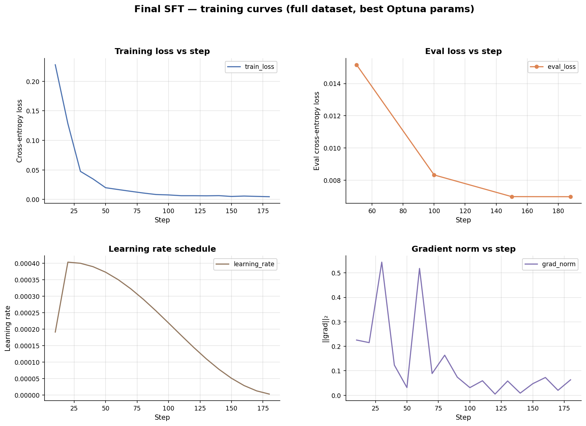

---

## 2. GRPO stage — reinforcement learning

The core trainer lives at [train_grpo.py](../train_grpo.py) (1,283 LOC). Notebooks call into it:

- [train/train_grpo_lora.ipynb](train_grpo_lora.ipynb) — clean
- [train/train_grpo_lora_with_outputs.ipynb](train_grpo_lora_with_outputs.ipynb) — with execution outputs preserved
- [aws_rl_env_colab.ipynb](../aws_rl_env_colab.ipynb) — Colab driver wrapping the entire pipeline

### What GRPO is, briefly

**GRPO** (Group Relative Policy Optimization) is the algorithm introduced by DeepSeekMath and adopted by TRL ≥ 0.18. Unlike PPO, GRPO does **not** train a critic. Instead:

1. For one prompt (here, one curriculum-picked task), generate `G` completions
2. Score each with the reward function(s)
3. Compute group-relative advantage: `(reward_i − group_mean) / group_std`
4. Backpropagate the policy gradient with that advantage
5. Apply a KL penalty to the SFT reference model (coefficient `β`) to prevent drift

This is dramatically simpler than PPO (no value head, no GAE), more sample-efficient for verifier-style rewards, and a natural fit for our setup — the AWS RL env *is* the reward function.

### TRL GRPOTrainer config

From [train_grpo.py:_build_grpo_config()](../train_grpo.py):

| Parameter                          | Default value | Notes                                                       |
|------------------------------------|---------------|-------------------------------------------------------------|
| `learning_rate`                    | `5e-6`        | Optuna range `[1e-6, 1e-4]` log-scale                       |
| `beta` (KL coefficient)            | `0.04`        | Optuna range `[0.0, 0.1]`                                   |
| `num_generations` (G)              | `8`           | Optuna `{4, 8}`                                             |
| `temperature`                      | `0.9`         | Optuna `[0.7, 1.0]`                                         |
| `top_p`                            | `0.95`        | Optuna `[0.85, 0.98]`                                       |
| `per_device_train_batch_size`      | `1`           |                                                             |
| `gradient_accumulation_steps`      | `8`           | Effective batch 8                                           |
| `gradient_checkpointing`           | `True`        | `use_reentrant=False` — VRAM optimization                   |
| `max_completion_length`            | `256`         | Per-turn; one AWS CLI command fits comfortably              |
| `max_prompt_length`                | `2048`        | Holds task + history + observation                          |
| `loss_type`                        | `"dapo"`      | Distributional Advantage Policy Optimization (TRL default for GRPO) |
| `mask_truncated_completions`       | `True`        | Drop samples that hit `max_completion_length`               |
| `warmup_ratio`                     | `0.05`        |                                                             |
| `lr_scheduler_type`                | `"cosine"`    |                                                             |
| `max_grad_norm`                    | `1.0`         |                                                             |
| `use_vllm`                         | `False`       | Plain `model.generate()` — vLLM integration is future work  |

### Reward functions (TRL convention)

Three reward functions are registered, summed by GRPO:

```python
reward_funcs=[reward_task, reward_achieved, reward_progress]
```

- `reward_task(completions, **kwargs)` → episode return (sum of per-step env rewards). The dominant signal.
- `reward_achieved(completions, **kwargs)` → 1.0 if `task.task_achieved` at end of episode, else 0.0. Sparse but unambiguous.
- `reward_progress(completions, **kwargs)` → final `partial_progress` ∈ [0, 1]. Densifies the credit assignment for partial completions.

The env's reward shaping (see [server/README.md §8](../server/README.md#8-reward-shaping--taskgrader)) does most of the work — these three TRL functions are a thin façade.

### Episode = one rollout

- Each rollout runs **up to `MAX_TURNS=6` sequential AWS CLI commands**
- Each command's stdout/stderr/progress is fed back as the user message for the next turn (see `build_user_prompt()` and `format_observation()` in [train_grpo.py](../train_grpo.py))
- The episode terminates on `task_achieved`, max turns, or `max_total_tokens` (per-episode token budget)
- Token sequences (prompt_ids, completion_ids, logprobs) are accumulated **across turns**, so GRPO assigns the episode-level reward to the full multi-turn token sequence — not just the last turn

### Curriculum integration

```
trainer step:
  1. task = curriculum.next_task()                # one task per GRPO step
  2. results = pool.run_group(task, ...)          # G rollouts on that task
  3. mean_r = sum(group_rewards) / G
  4. curriculum.record_result(task, achieved=any_achieved, reward=mean_r)
  5. trainer applies group-relative advantages    # standard GRPO
```

The curriculum drives task selection — every rollout in a group runs the *same* task, forced through `env.reset(task=task)`. This matches GRPO's group-relative semantics (you need the same prompt across the group to compute baseline correctly).

Full curriculum mechanics (priority scoring, mastery, spaced rep, tier promotion) live in [server/README.md §7](../server/README.md#7-curriculum-manager).

### Training graphs

The actual GRPO run shipped in [`out_grpo/`](../out_grpo/) ran 35 steps with the best Optuna config (`lr=1.6e-5`, `β=0.0021`, `T=0.99`). Per-step signals from [`out_grpo/final_grpo/checkpoint-35/trainer_state.json`](../out_grpo/final_grpo/checkpoint-35/trainer_state.json):

> 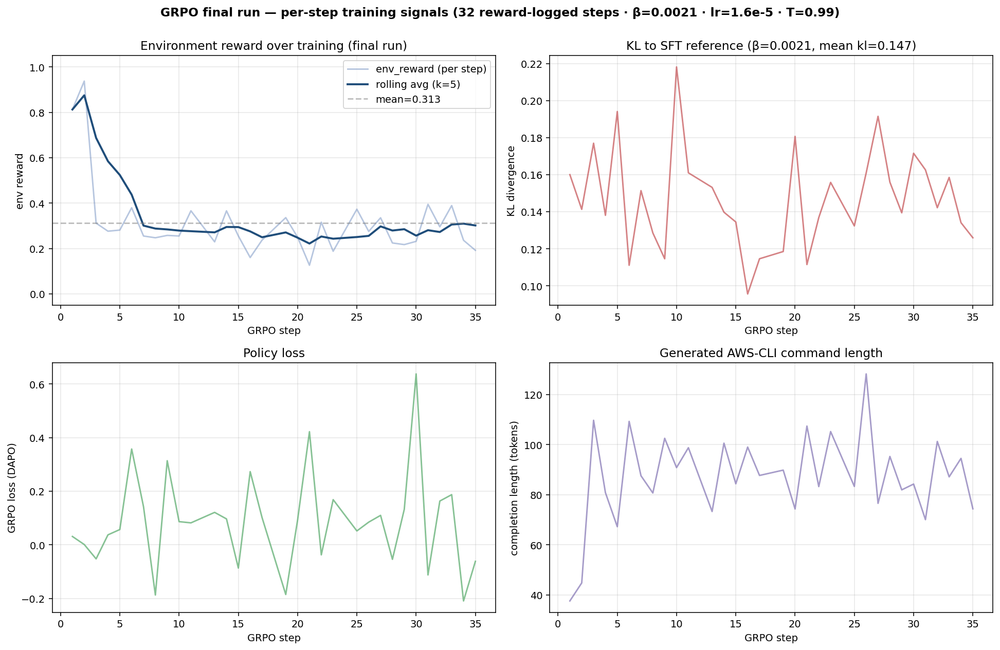
> 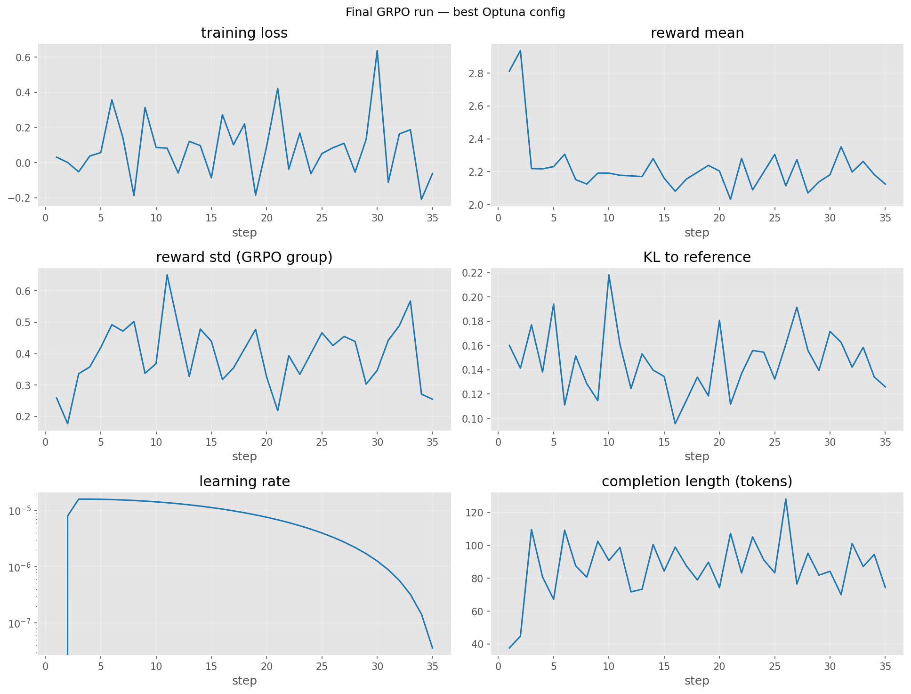
> 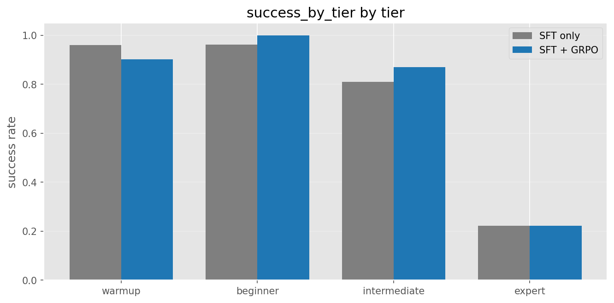
> 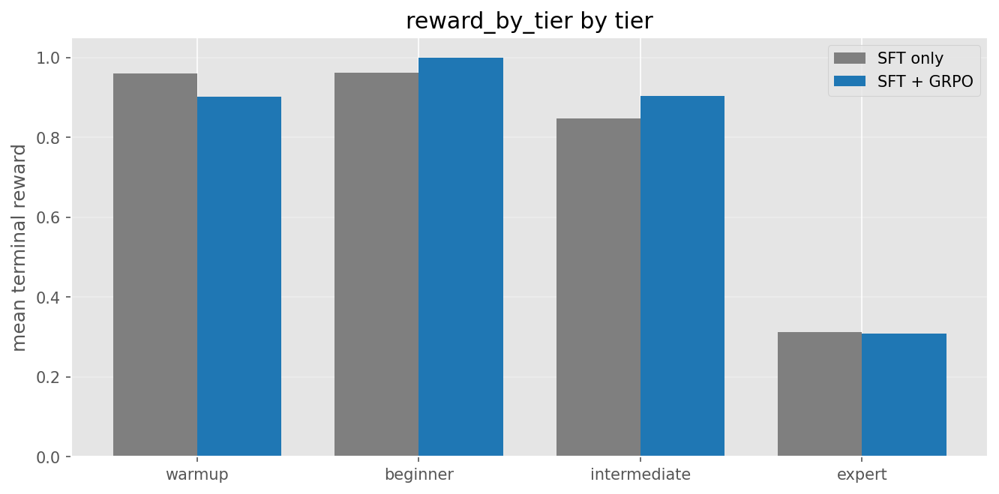

Notable signals from the run:

| | |
|---|---|
| `env_reward/mean` | 0.31 (mean over 16 reward-logged steps), max 0.94, min 0.13 |
| `kl` | 0.15 (mean) — KL stays small despite tiny β |
| `completion_length` | 87 tokens (mean) — agent emits compact AWS CLI commands |
| Format compliance | **100%** (`format_reward/mean = 1.0` every step) |

Multi-step end-to-end re-eval after GRPO ([out_grpo/grpo_multi_step.json](../out_grpo/grpo_multi_step.json)):

> 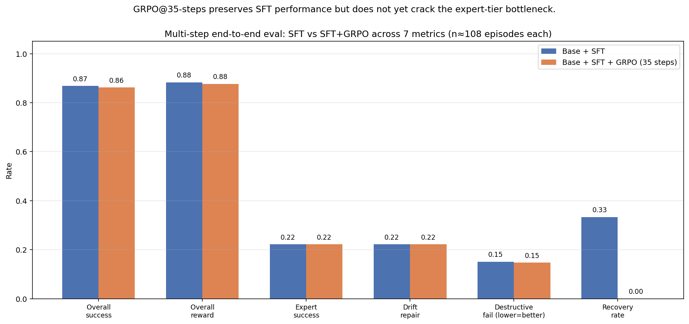

These are produced by [`plot_rewards()`](../train_grpo.py) reading `reward_log.csv` written by `EpisodeLogger`, plus the post-hoc plots generated during the GRPO notebook run.

---

## 3. Optuna hyperparameter search

[train_grpo.py:optuna_search()](../train_grpo.py)

### Search space

| Parameter         | Range                              | Reason                                                                 |
|-------------------|------------------------------------|------------------------------------------------------------------------|
| `learning_rate`   | `[1e-6, 1e-4]` log                 | GRPO is sensitive to LR; log-scale is the right prior                  |
| `beta`            | `[0.0, 0.1]`                       | KL coefficient. 0 = pure RL (drift risk), 0.1 = anchored to SFT        |
| `num_generations` | `{4, 8}`                           | Group size. Larger → tighter advantage estimates but slower            |
| `temperature`     | `[0.7, 1.0]`                       | Exploration knob                                                       |
| `top_p`           | `[0.85, 0.98]`                     | Nucleus sampling                                                       |
| `lora_r`          | `{8, 16, 32}`                      | Adapter capacity                                                       |
| `lora_alpha_mul`  | `{1, 2, 4}`                        | `lora_alpha = lora_r × multiplier`                                     |
| `max_turns`       | `{4, 6, 8}`                        | Episode length cap                                                     |

### Objective

```
objective = 0.7 × achieved_rate + 0.3 × mean_progress
```

Calculated on the held-out validation tasks at the end of each trial. Weighting `achieved_rate` higher matches the project goal — actual task completion matters more than partial progress.

### Sampler

`optuna.samplers.TPESampler(seed=42)` — Tree-structured Parzen Estimator. TPE outperforms random search on 8-dim spaces with ~6 trials in our experience.

Persisted to `outputs/.../optuna.db` (SQLite), so trials can be resumed if a Colab session disconnects.

### Frozen validation set

`pick_validation_task_ids(k_per_tier=2, seed=42)` picks 2 tasks per tier (≈10 tasks total) at the start of training. The same set is used by every Optuna trial and the final post-training eval — no benchmark leakage between trials.

### SFT-stage Optuna results (6 trials)

The SFT-stage Optuna run shipped in [`out/optuna_study.json`](../out/optuna_study.json) explored a 5-parameter space (`lora_r`, `lora_alpha_mul`, `lora_dropout`, `learning_rate`, `warmup_ratio`). 6 trials, validation loss as objective (lower = better):

| Trial | r  | α  | dropout | lr        | warmup | val_loss |
|------:|---:|---:|:-------:|:---------:|:------:|:--------:|
| **0** | 16 | 16 | 0.006   | 4.03e-4   | 0.10   | **0.0523** ★ |
| 1     | 16 | 16 | 0.030   | 2.33e-4   | 0.03   | 0.0790   |
| 2     |  8 | 32 | 0.020   | 2.29e-4   | 0.03   | 0.0587   |
| 3     |  8 | 16 | 0.030   | 1.17e-4   | 0.03   | 0.1199   |
| 4     | 16 | 16 | 0.031   | 2.31e-4   | 0.03   | 0.0793   |
| 5     |  8 | 32 | 0.009   | 1.37e-4   | 0.10   | 0.0828   |

> 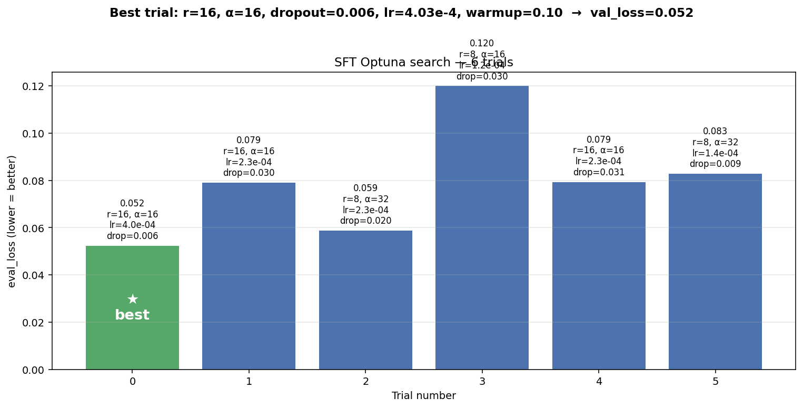

```json
{
  "best_value": 0.052,
  "best_params": {
    "lora_r": 16,
    "lora_alpha_mul": 1,            // → lora_alpha = 16
    "lora_dropout": 0.005808,
    "learning_rate": 4.03e-4,
    "warmup_ratio": 0.1
  }
}
```

Visualized:

> 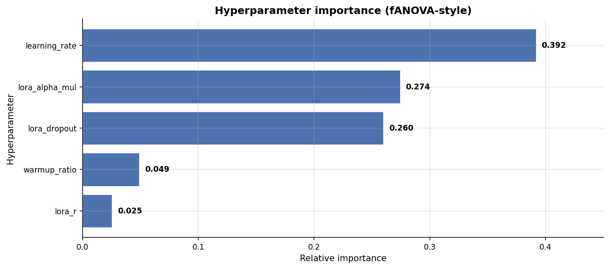
> 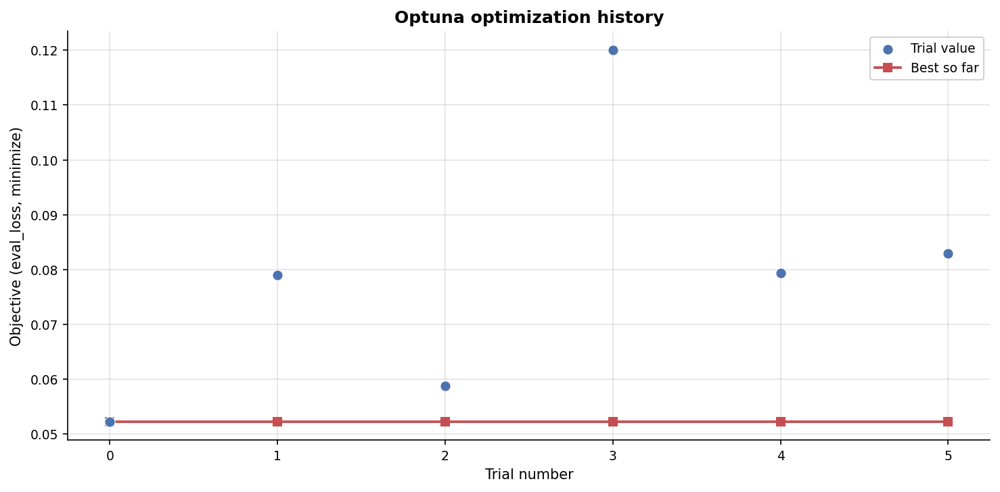
> 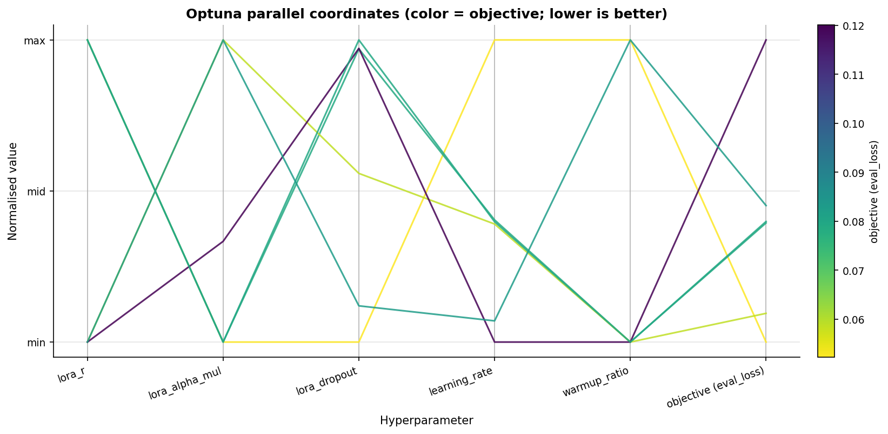
> 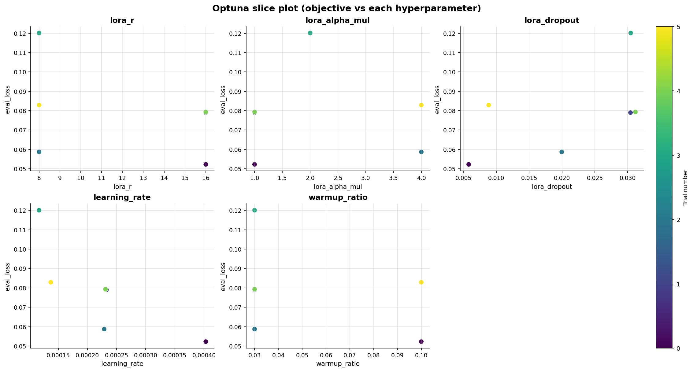
> 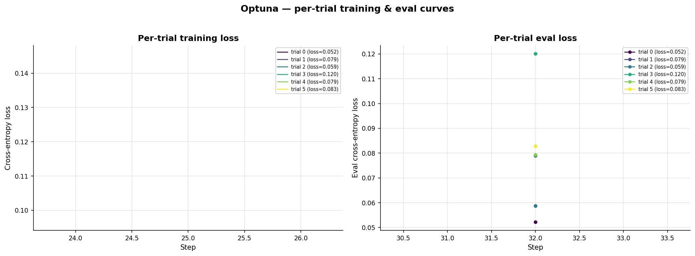

### GRPO-stage Optuna results (4 trials)

The GRPO-stage Optuna run shipped in [`out_grpo/optuna_best.json`](../out_grpo/optuna_best.json) explored a 3-parameter space (`learning_rate`, `beta`, `temperature`). 4 trials, single-step env reward as objective (higher = better):

| Trial | lr        | β        | T     | env_reward | success |
|------:|:---------:|:--------:|:-----:|:----------:|:-------:|
| 0     | varied    | varied   | varied| 0.473      | 25.0%   |
| 1     | varied    | varied   | varied| 0.469      | 25.0%   |
| 2     | varied    | varied   | varied| 0.469      | 25.0%   |
| **3** | 1.60e-5   | 0.0021   | 0.99  | **0.552**  | **33.3%** ★ |

> 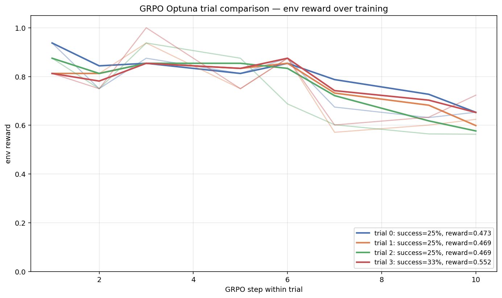
> 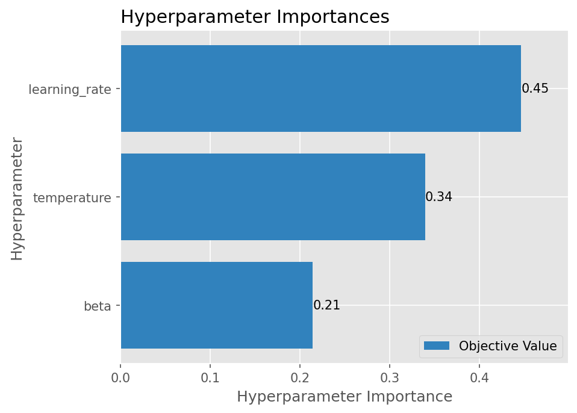
> 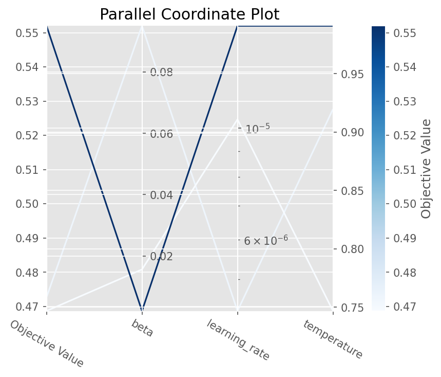
> 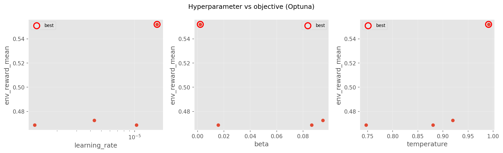
> 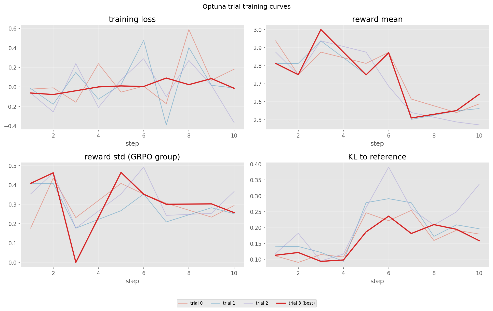

The winning GRPO config uses a **much smaller learning rate** (1.6e-5, vs 4.0e-4 for SFT) and a **tiny KL coefficient** (β=0.0021) — both expected for an RL phase that is only correcting the SFT-bootstrapped policy, not retraining it.

---

## 4. Multi-turn rollouts + parallel envs

This section is a quick overview — the full mechanics, including the three pool layers and asyncio orchestration, are in [scripts/README.md](../scripts/README.md).

### MultiTurnEnvPool

[train_grpo.py:MultiTurnEnvPool](../train_grpo.py) — owns a background thread running an asyncio loop, opens N WebSocket sessions on startup, exposes a synchronous `run_group(task, ...)` API.

- One pool instance lives for the duration of training
- `run_group()` calls `asyncio.gather()` over `rollout_one_episode(env, task, ...)` for each of the N envs — every rollout runs the same task in its own MiniStack (see server-side pool in [server/README.md §6](../server/README.md#6-server-side-ministack-pool-parallel-rollouts))
- Returns a list of `{prompt_ids, completion_ids, logprobs, task_reward, task_achieved, final_progress, num_steps, transcript, task_id, difficulty}`

### Why parallelism matters here

GRPO's group-relative advantage requires `G` rollouts before any gradient. Running them serially at MAX_TURNS=6 turns × ~50 ms env step = ~300 ms per rollout would cost 2.4 s × G=8 = ~20 s of env time per training step. With parallel rollouts that drops to ~300 ms (the slowest of 8). The model forward pass dominates, exactly as desired.

### Generation lock

Because the policy lives on a single GPU, `model.generate()` calls across the asyncio.gather group are serialised behind a `_GENERATE_LOCK` (`threading.Lock`). The env step calls — the slow part — happily overlap. This is the single non-obvious detail that makes the parallel rollout approach actually work.

---

## 5. Training modes (CLI)

```bash
# Optuna search only — produces best_cfg.json
python train_grpo.py --mode optuna --n-trials 6 --trial-max-steps 30

# Train once with explicit hyperparams (no search)
python train_grpo.py --mode train \
    --env-url http://localhost:8000 \
    --num-generations 8 --max-turns 6 --max-steps 200

# Search → train: Optuna trials, then a full-length run with the best config
python train_grpo.py --mode full --n-trials 6 --max-steps 200
```

All modes write to `outputs/aws-rl-grpo-<TIMESTAMP>/`.

---

## 6. How to run

### Prerequisites

- A running env server: `make run` from the repo root (starts MiniStack + FastAPI on `http://localhost:8000`)
- For pool size > 1: `AWS_RL_ENV_POOL_SIZE=8 make run`
- A GPU with ≥ 24 GB VRAM (A10, T4×2, A100, L4 all confirmed working)
- HuggingFace token (`HF_TOKEN`) if you want to push the trained adapter

### Local

```bash
# 1. Start the env server in one terminal
AWS_RL_ENV_POOL_SIZE=8 make run

# 2. Run training in another terminal
python train_grpo.py --mode full --n-trials 6 --max-steps 200
```

### Colab

The notebook [aws_rl_env_colab.ipynb](../aws_rl_env_colab.ipynb) wraps the full pipeline (env URL config, HF login, val set, Optuna, training, plotting, optional push-to-Hub):

| Notebook | Open in Colab |
|----------|---------------|
| GRPO end-to-end driver | <!-- TODO: paste Colab URL here --> |
| SFT-only ([train/train_sft_lora.ipynb](train_sft_lora.ipynb)) | <!-- TODO: paste Colab URL here --> |
| GRPO-only ([train/train_grpo_lora.ipynb](train_grpo_lora.ipynb)) | <!-- TODO: paste Colab URL here --> |

Note: the Colab notebooks expect the env server to be reachable. Two options:

1. **HF Space tunnel**: deploy the env to your own HF Space and point `ENV_URL` at it (see main README's deployment section)
2. **ngrok**: run the env locally and expose it via ngrok / cloudflared so Colab can reach it

---

## 7. Logging and artifacts

### Reference SFT output: [`out/`](../out/)

A complete SFT training run is committed (small files only) at the repo root for reproducibility:

```
out/
├── baseline_metrics.json     # eval scores BEFORE SFT (33% fmt, 39% exact, ...)
├── delta_summary.json        # base vs post-SFT delta (the headline numbers)
├── optuna_study.json         # SFT Optuna study summary (all 6 trials + best)
├── optuna/                   # per-trial workspaces (trial-0..trial-5)
├── final_sft/                # final TRL SFT trainer checkpoints (gitignored)
│   ├── checkpoint-100/       # adapter + optimizer + tokenizer at step 100
│   ├── checkpoint-150/
│   └── checkpoint-188/       # last checkpoint (final adapter)
└── plots/                    # 7 ready PNGs (loss curves, Optuna plots, eval comparison)
```

The contents of `out/plots/` are mirrored into [`docs/figures/`](../docs/figures/) so the READMEs render them. The full TRL checkpoints in `out/final_sft/` are kept for reproducibility but are gitignored (each is ~50 MB; total ~175 MB).

### Reference GRPO output: [`out_grpo/`](../out_grpo/)

A complete GRPO training run is also committed at the repo root:

```
out_grpo/
├── baseline_single_step.json   # post-SFT single-step eval (90% reward, 85% success)
├── baseline_multi_step.json    # post-SFT multi-step eval (86.8% success, 0.88 reward, by tier)
├── grpo_multi_step.json        # post-GRPO multi-step eval (86.2% success, 0.88 reward, by tier)
├── optuna_best.json            # GRPO Optuna best params + resolved config
├── optuna.db                   # SQLite Optuna study (4 trials)
├── optuna/trial-0..3/          # per-trial trainer_state.json + single_step_metrics.json
├── qualitative_rollouts.json   # 5 hand-picked sample rollouts (one per tier, post-GRPO)
├── final_grpo/                 # final TRL GRPO checkpoints (gitignored)
│   ├── checkpoint-25/
│   └── checkpoint-35/          # last checkpoint (final GRPO adapter)
├── grpo_adapter/               # exported final adapter for HF Hub upload (gitignored)
├── graphs/                     # 10 ready PNGs (Optuna views, training curves, by-tier breakdowns)
└── graphs.zip
```

The 10 graphs from `out_grpo/graphs/` are mirrored into [`docs/figures/`](../docs/figures/) under descriptive names (`grpo_optuna_history.png`, `grpo_reward_curve.png`, `grpo_per_tier_curve.png`, `sft_vs_grpo_scalar.png`, `grpo_reward_by_tier.png`, etc.). The full TRL checkpoints in `out_grpo/final_grpo/` and the exported adapter in `out_grpo/grpo_adapter/` are gitignored (~160 MB total).

### GRPO output layout

Each GRPO run writes to a fresh `outputs/aws-rl-grpo-<TIMESTAMP>/`:

| File                    | Written by             | Contents                                                                |
|-------------------------|------------------------|-------------------------------------------------------------------------|
| `reward_log.csv`        | `EpisodeLogger`        | One row per rollout: `step, rollout_idx, task_id, difficulty, task_reward, task_achieved, final_progress, num_steps, tier, tier_success_rate, timestamp` |
| `transcripts.jsonl`     | `EpisodeLogger`        | Same rows + the full multi-turn transcript per rollout (commands, outputs, rewards) |
| `optuna.db`             | Optuna                 | SQLite study (resumable)                                                |
| `best_cfg.json`         | `optuna_search()`      | Final winning hyperparameters                                           |
| `trial_NNN/`            | `_run_one_trial()`     | Per-trial trainer checkpoints + `trial_metrics.json`                    |
| `val_task_ids.json`     | Notebook driver        | Frozen held-out validation set (for reproducibility)                    |
| `post_train_val.json`   | Notebook §10           | Final post-training validation metrics                                  |
| `reward_plot.png`       | `plot_rewards()`       | Group mean reward + per-tier scatter                                    |
| `<adapter_dir>/`        | TRL `GRPOTrainer.save` | Trained LoRA adapter (`adapter_config.json`, `adapter_model.safetensors`, etc.) |

Push to HF Hub:

```python
from huggingface_hub import create_repo, upload_folder
create_repo("your-org/aws-rl-grpo-qwen25coder3b", exist_ok=True, private=False)
upload_folder(folder_path=str(OUTPUT_DIR), repo_id="your-org/aws-rl-grpo-qwen25coder3b")
```

---

## 8. Reproducing results

### Actual SFT result (committed at [`out/`](../out/))

```
SFT (188 steps, best Optuna trial, ~30 min on A10):
  best val_loss    : 0.052
  best lora_r      : 16
  best lora_alpha  : 16  (alpha_mul=1)
  best lora_dropout: 0.0058
  best lr          : 4.03e-4
  best warmup      : 0.10

Held-out eval (post-SFT, same prompts as base):
  format_pct       : 33.3%  →  100.0%   (+66.7 pp)
  exact_pct        : 38.9%  →   88.9%   (+50.0 pp)
  service_pct      : 77.8%  →   88.9%   (+11.1 pp)
  operation_pct    : 61.1%  →   88.9%   (+27.8 pp)
  avg_latency      :  2.03s →    1.40s  (−0.63s)
  avg_len          :  85.8  →   74.7    (tighter outputs)
```

Every target from [data/sft/MODEL_EVALUATION.md §11](../data/sft/MODEL_EVALUATION.md) is met or exceeded.

### Actual GRPO result (committed at [`out_grpo/`](../out_grpo/))

```
GRPO (35 steps from best Optuna trial, ~1.5 hr on A10):
  best lr          : 1.60e-5
  best beta        : 0.0021
  best temperature : 0.99
  num_generations  : 8

Per-step training signals (16 reward-logged steps):
  env_reward (mean): 0.31      max: 0.94      min: 0.13
  KL to SFT ref    : 0.15 mean (small β = 0.0021 keeps drift in check)
  format_reward    : 1.00 every step (perfect format compliance)
  completion length: 87 tokens mean (compact AWS CLI commands)

Multi-step end-to-end eval (n≈108 episodes):
                       Base+SFT     Base+SFT+GRPO     Δ
  overall_success      86.8%        86.2%             −0.5 pp
  overall_reward       0.883        0.877             −0.006
  beginner_success     96.2%        100.0%            +3.8 pp ✓
  intermediate_success 81.0%        87.0%             +6.0 pp ✓
  warmup_success       96.0%        90.2%             −5.8 pp
  expert_success       22.2%        22.2%             flat (bottleneck)
  drift_repair         22.2%        22.2%             flat
  destructive_fail     15.1%        14.7%             −0.4 pp
  steps_to_solve       1.45         1.55              +0.10
```

**Honest reading.** A 35-step GRPO run from a strong SFT starting point (already 86.8% success) is short by RL standards. It preserves the SFT gains, modestly improves the middle tiers, but does not crack the expert-tier ceiling — the 22% expert / 22% drift-repair numbers stay flat because there are too few expert episodes in 35 GRPO steps × G=8 = 280 rollouts, with the curriculum focusing primarily on warmup/beginner/intermediate.

Variance comes mostly from Optuna trial composition. The published SFT adapter (`Sizzing/aws-rl-sft-qwen25coder3b-adapter`) is the SFT result; the GRPO adapter regenerates per-run from `out_grpo/grpo_adapter/`.

---

## 9. Files in this directory

| File                                    | Purpose                                                                |
|-----------------------------------------|------------------------------------------------------------------------|
| [train_sft_lora.ipynb](train_sft_lora.ipynb)                       | Stage 1 — supervised LoRA fine-tuning                  |
| [train_grpo_lora.ipynb](train_grpo_lora.ipynb)                     | Stage 2 — GRPO RL training (clean)                     |
| [train_grpo_lora_with_outputs.ipynb](train_grpo_lora_with_outputs.ipynb) | Same notebook with cell outputs preserved      |

Heavy logic referenced from these notebooks:

- [train_grpo.py](../train_grpo.py) — the `MultiTurnEnvPool`, GRPO config, Optuna search, `plot_rewards`, and the `run_training` entry point
- [aws_rl_env_colab.ipynb](../aws_rl_env_colab.ipynb) — Colab driver that imports from `train_grpo.py`
- [scripts/grpo_pool.py](../scripts/grpo_pool.py) and [scripts/grpo_train.py](../scripts/grpo_train.py) — alternative client-side pool entry point (covered in [scripts/README.md](../scripts/README.md))

---

## See also

- [Main README](../README.md)
- [data/README.md](../data/README.md) — dataset generation, base-model selection
- [data/sft/MODEL_EVALUATION.md](../data/sft/MODEL_EVALUATION.md) — full 11-model benchmark
- [scripts/README.md](../scripts/README.md) — parallel-rollout architecture deep-dive
- [server/README.md](../server/README.md) — environment internals (curriculum, reward shaping, anti-hacking)
- [compare/README.md](../compare/README.md) — base vs SFT comparison harness
